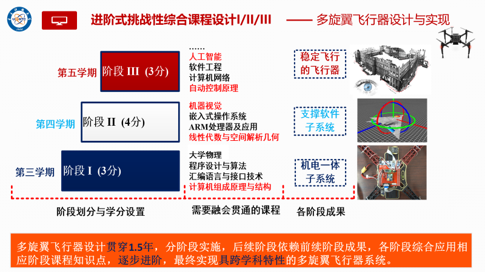
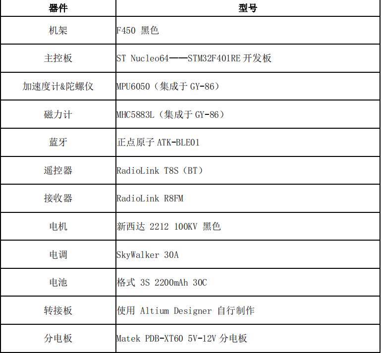
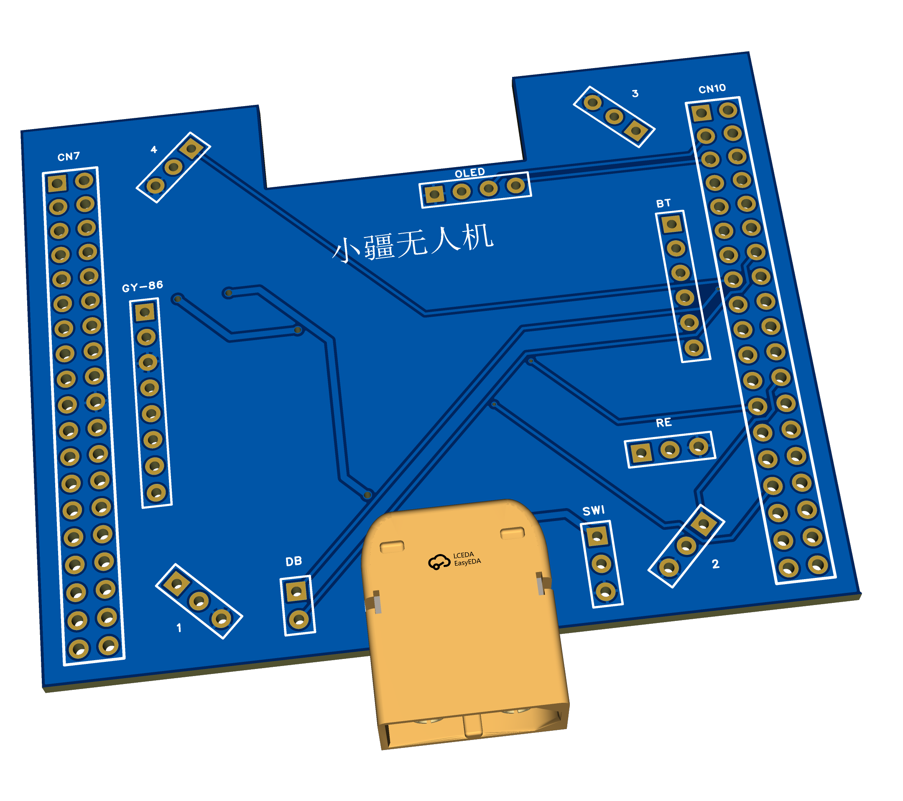

# Quadrotor
电子科技大学信息与软件工程学院嵌入式方向综合设计——基于STM32F401RET6的四轴飞行器

## 项目概述

## 飞行器器材

## 选用引脚

| 协议  |      引脚号       |             备注              |
| :---: | :---------------: | :---------------------------: |
|  TIM  |  PB0,PB1,PA6,PA7  |        通用定时器TIM3         |
| USART | PA2,PA3 PA11,PA12 | USART2,USART6  蓝牙和串口调试 |
|  IIC  | PB8,PB9  PB10,PB3 |     IIC1,IIC2 OLED和GY86      |

## 转接板

### 原理图

### PCB图

## 挑战点

主要是项目学习过程中的学习路径，可能与实际开发有所不同。

### 阶段一

- [x] 用 KEIL5 点亮STM32的灯并使之闪烁（汇编实现）
- [x] 使用 Altium Designer 设计 STM32 硬件原理图
- [x] 使用 Altium Designer 设计 STM32 PCB板图
- [x] 裸机下驱动姿态传感器 GY-86
- [x] 裸机下驱动蓝牙模块
- [x] 裸机下驱动电机
- [x] 使用 Altium Designer 完成四轴飞行器转接板原理图及PCB图设计与制作
- [x] 硬件子系统接受并解析遥控器命令
- [x] 启动硬件子系统
- [x] 裸机软件集成

------

### 阶段二

- [x] 用KEIL重构uc/OS II 新工程
- [x] ARM STM-32 事件驱动机制
- [x] ARM STM-32 时间驱动机制
- [x] 启动ARM STM-32
- [x] 任务上下文切换
- [x] uc/OS II 在STM32上的移植 Pt.I
- [ ] uc/OS II 在STM32上的移植 Pt.II
- [ ] 应用子系统设计/System View与任务级调试
- [ ] 系统工程重构与优化
- [ ] 内核资源互斥访问机制
- [ ] 用MakeFile构建自己的工程

### 阶段三

（主要关于姿态解算和PID反馈控制，先待定）