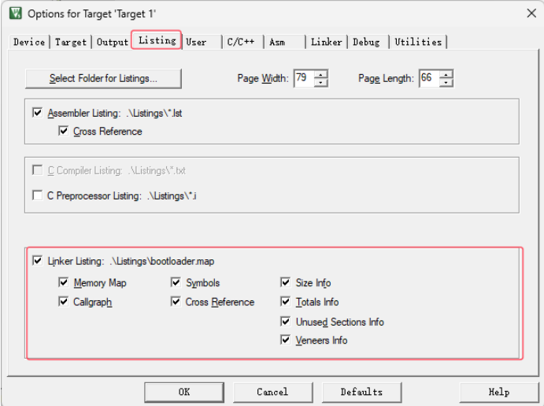
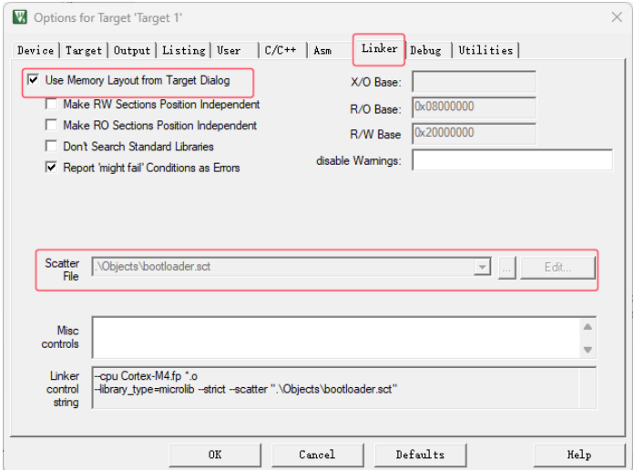
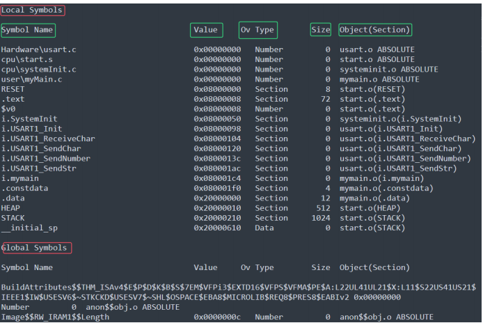
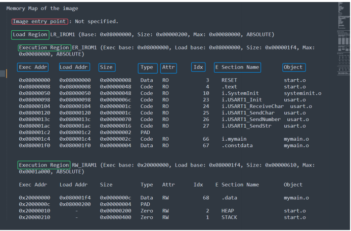
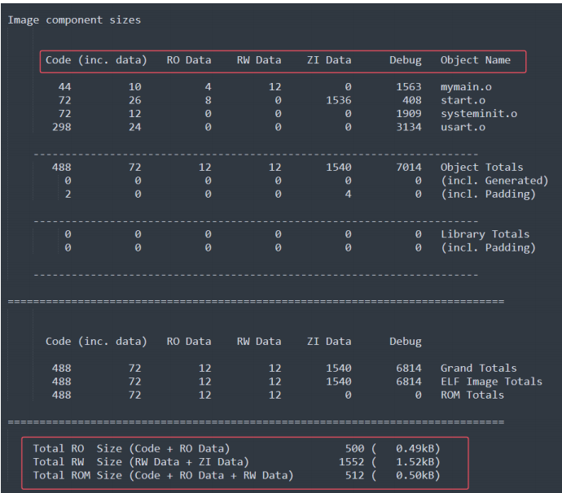
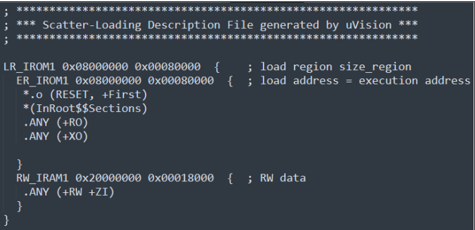
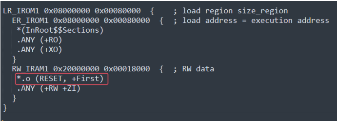
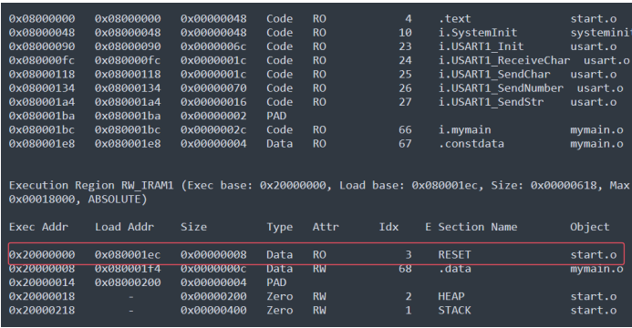
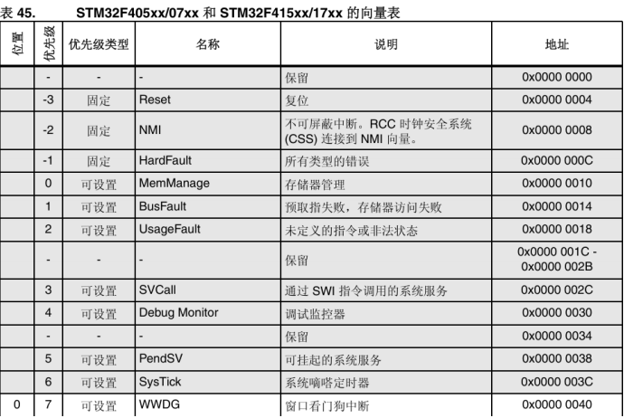
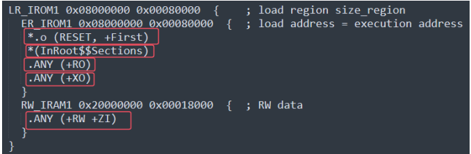

+++
title = 'Stm32学习小记（四）——重构Startup文件及验证'
date = 2025-04-01T00:38:54+08:00
draft = true

+++

## 认识相关文件

### 前置工作

点击魔术棒 --> 点击Listing --> 将Linker Listing全部勾选（生成.map文件）



点击魔术棒 --> 点击Linker --> 选取Scatter File路径 并 勾选Use Memory Layout from Target Dialog（生成.sct文件）

（如果不能Edit，取消勾选Use，更改完再勾选回Use）



再点击User--> 勾选Run #2


### .map文件

**位置：**位于Listings文件夹，命名为 项目名.map


#### 节区的跨文件引用 Section Cross References

```
stm32f4xx_usart.o(i.USART_DeInit) refers to
stm32f4xx_rcc.o(i.RCC_APB1PeriphResetCmd) for RCC_APB1PeriphResetCmd
```

翻译成中文就是stm32f4xx_usart模块（stm32f4xx_usart.o）中的USART_DeInit函数，

*引用（调用）*了stm32f4xx_rcc模块（stm32f4xx_rcc.o）中的RCC_APB1PeriphResetCmd函数


#### 移除未调用模块 Removing Unused input sections from the image

我们以下面这一行为例：

```
Removing stm32f4xx_adc.o(i.ADC_CommonInit), (48 bytes).
```

移除了stm32f4xx_adc模块（stm32f4xx_adc.o）中的ADC_CommonInit函数（占用48字节）

其中该部分最后一行还有所有未调用模块的统计

```
902 unused section(s) (total 43143 bytes) removed from the image.
```


#### 映射符号表 Image Symbol Table：

这部分分为两大类 **Local Symbols**（局部） 和 **Global Symbols**（全局）



**Symbol Name**：符号名称

**Value**：存储对应的地址

**Ov Type**：符号对应的类型 （Number、Section、Thumb Code、Data等）

**Size**：存储大小

**Object(Section)**：段目标，即所在模块（源文件）


#### 内存（映射）分布Memory Map of the image



**Image Entry point** ： 指映射入口地址，如果自己重构了start文件，会出现Not specified

（不影响正常进入程序，但是会WARNING，可以在魔术棒的Linker下的Misc controls 处加入入口地址：--entry Reset_Handler）。


没有重写的Image Entry point一般包含下面这些信息：

**Execution Region**：执行区域

**Loading Region**：加载区域

**Base Addr**：存储地址

**Size**：存储大小

**Type**：类型（有Data,Code,Zero,PAD等）

**Attr**：属性

**Section Name**：段名

**Object**：目标


#### 存储组成大小Image component sizes

主要展示RO、RW、ROM大小，多了debug状态下文件大小。



### .sct文件

.sct文件即为分散加载文件（Linux对应的是.ld文件）

链接器根据该文件的配置分配各个节区地址，生成分散加载代码，因此我们通过修改该文件可以定制具体节区的存储位置。


#### 文件解释

一般打开后长这样：



下面是对代码的解释：

```
加载域名 起始地址 大小{；加载区域大小 （分号后面是注释）

	运行域名 起始地址 大小 ；执行地址

	{
		中断向量表起始地址， +First表示强制放到首地址
		ARM相关库，InRoot$$Sections即ARM库的链接器标号，主要作用COPY RW区到RAM，
		然后再RW区后面创建ZI区。 库函数__main函数中有这个段。 它是__main()的一部分。
		编译文件RO只读在该区域
		编译文件XO只执行在该区域
	}
	运行内存名字 起始地址 大小
	{
	编译可读可写，静态区
	}

}
```


#### 验证作用

我们不妨试一下修改中断向量表的位置，

首先关闭Use Memory Layout From Target Dialog，代表用我们自己的.sct来加载

更改.sct文件，把RESET放入RAM中：



Rebuild后再打开.map文件



可以看到RESET已经被我们拷贝到了RAM中了。


## 重写start文件

#### 1. 栈空间分配

```assembly
Stack_Size EQU 0x00000400

AREA STACK, NOINIT, READWRITE, ALIGN=3

Stack_Mem SPACE Stack_Size

__initial_sp
```

#### 2. 堆空间分配

与栈空间分配不同的是Heap需要 **__heap_base** 与 **__heap_limit**两个参数进行限制，而栈只需要一个栈指针就可以了（当然都还需要大小)。

```asm
Heap_Size EQU 0x00000200
AREA HEAP, NOINIT, READWRITE, ALIGN=3
__heap_base
Heap_Mem SPACE Heap_Size
__heap_limit
```


#### 3. 中断向量表空间分配

对于我们不需要的中断函数，我们都可以直接 **DCD 0**，因为我们当前重写与验证不需要中断，所以我们只需要 第一行__initial_sp 和 Reset_Handler

```assembly
__Vectors DCD __initial_sp ; Top of Stack
DCD Reset_Handler ; Reset Handler
__Vectors_End
__Vectors_Size EQU __Vectors_End - __Vectors
```

具体要写入哪些向量，需要查看对应芯片手册：



在中断和事件中查看向量表（中文参考手册没有STM32F401RE）

> 这里需要注意的是，我们在使用某个STM32产品的时候，不能够只看手册，还要对照官方的start文件的中断向量表中有没有
>
> 对应的中断向量。如果没有，需要在startup中加上！


#### 4.Reset_Handler函数重写

```assembly
Reset_Handler PROC
	EXPORT Reset_Handler [WEAK]
	IMPORT mymain
	IMPORT SystemInit
	IMPORT myScratterLoad
	LDR R0, =SystemInit
	BLX R0
	LDR R0, =myScratterLoad
	BLX R0
	BL mymain ;跳转去执行main函数
	B . ;原地跳转，即处于循环状态
	ENDP
	ALIGN ;填充字节使地址对齐
```

Rest_Handler函数还是比较简单的，只需要调用SystemInit和myScratterLoad进行初始化之后就可以进入我们的main函数了


#### 5.ScratterLoad函数重写

在之前的讲解中，我们其实已经知道了该函数主要执行的是将数据拷贝到它该去的地方，

在链接完之后，我们可以获得以下参数供我们去操作：

```assembly
IMPORT |Image$$RW_IRAM1$$Base| ;从别处导入data段的链接地址

IMPORT |Image$$RW_IRAM1$$Length| ;从别处导入data段的长度

IMPORT |Load$$RW_IRAM1$$Base| ;从别处导入data段的加载地址

IMPORT |Image$$RW_IRAM1$$ZI$$Base| ;从别处导入ZI段的链接地址

IMPORT |Image$$RW_IRAM1$$ZI$$Length|;从别处导入ZI段的长度
```


- **复制数据段**：

```assembly
; 复制数据段
	LDR R0, = |Load$$RW_IRAM1$$Base| ;将data段的加载地址存入R0寄存器
	LDR R1, = |Image$$RW_IRAM1$$Base| ;将data段的链接地址存入R1寄存器
	LDR R2, = |Image$$RW_IRAM1$$Length| ;将data段的长度存入R2寄存器
CopyData
	SUB R2, R2, #4 ;每次复制4个字节的data段数据
	LDR R3, [R0, R2] ;把加载地址处的值取出到R3寄存器
	STR R3, [R1, R2] ;把取出的值从R3寄存器存入到链接地址
	CMP R2, #0 ;将计数和0相比较
	BNE CopyData ;如果不相等，跳转到CopyData标签处，相等则往下执行
```

我们只需要将加载地址的数据复制到链接地址即可,打开我们的.sct文件



框起来的就是对应的数据，据此可以推断出链接地址。比如因为链接文件规定了RESET在IROM的首地址，所以在.map中可以看到0x08000000加载了RESET。


- **清除BSS段：**

```assembly
; 清除BSS段
	LDR R0, = |Image$$RW_IRAM1$$ZI$$Base| ;将bss段的链接地址存入R1寄存器
	LDR R1, = |Image$$RW_IRAM1$$ZI$$Length| ;将bss段的长度存入R2寄存器
CleanBss
	SUB R1, R1, #4 ;每次清除4个字节的bss段数据
	MOV R3, #0 ;将0存入r3寄存器
	STR R3, [R0, R1] ;把R3寄存器存入到链接地址
	CMP R1, #0 ;将计数和0相比较
	BNE CleanBss ;如果不相等，跳转到CleanBss标签处，相等则往下执行
```

与上面类似，只是把0拷贝过去就可以了


## 验证

### 验证工具

使用串口工具，用C语言操控寄存器实现串口通信（不要汇编！不要用库函数！）形如：

```c
// 阻塞式发送单个字符
void USART1_SendChar(uint8_t ch)
{
while (!(USART1_SR & (1 << 7))); // 等待TXE标志置位
USART1_DR = (ch & 0xFF);
}
```

点击魔术棒 --> Debug --> Settings --> Flash Download --> Erase Full Chip（全片清除)

### 验证代码

#### a. RW-Data ZI-Data Const-Data

```c
#include "usart.h"

int RWData = 1234;

int ZIData;

const int ConstData = 4321;


void mymain(void){

	USART1_Init();

	uint32_t p;

	USART1_SendStr("\nRW-Data value: ");

	USART1_SendNumber(RWData, 10);

	USART1_SendStr(" addr:");

	p = (uint32_t)&RWData;

	USART1_SendNumber(p, 16);
    

	USART1_SendStr("\nZI-Data value: ");

	USART1_SendNumber(ZIData, 10);

	USART1_SendStr(" addr:");

	p = (uint32_t)&ZIData;

	USART1_SendNumber(p, 16);
    

	USART1_SendStr("\nConst-Data value:");

	USART1_SendNumber(ConstData, 10);

	USART1_SendStr(" addr:");

	p = (uint32_t)&ConstData;

	USART1_SendNumber(p, 16);
    

	while(1){

			}
	}
```

得到结果：

```
RW-Data value: 1234 addr:20000000
ZI-Data value: 0 addr:20000004
Const-Data value:4321 addr:800028C
```

可以看到RW-Data在0x20000000，在RAM中,但是ZI-Data却不是在ZI-Data区域，其实是我们的编译器已经将其进行了初始化，所以还是算到了ZI-Data里面；其中，Const-Data则在Flash中。


#### b. 去除myScatterLoad后

我们来去除myScatterLoad函数，还是使用原来的函数，查看结果为：

```
RW-Data value: 3758811134 addr:20000000
ZI-Data value: 103643149 addr:20000004
Const-Data value:4321 addr:8000284
```

可以看到因为我们没有将RW-Data和ZI-Data拷贝到RAM中，所以打印出来的value是乱码；而Const-Data因为在Flash中，则是我们指定的值。


#### c. 将RW-Data放到Flash中

更改.sct文件，将RW数据放入IROM中：

```
LR_IROM1 0x08000000 0x00080000 { ; load region size_region jia
ER_IROM1 0x08000000 0x00080000 { ; load address = execution address
	*.o (RESET, +First)
	*(InRoot$$Sections)
	.ANY (+RO)
	.ANY (+XO)
	.ANY (+RW)
	}
	RW_IRAM1 0x20000000 0x00018000 { ; RW data
	.ANY (+ZI)
	}
}
```

我们将RW数据放到Flash中（不可以将ZI数据放入到Flash中），因为ZI数据还有Stack和Heap段，如果这两个数据段在Flash中，就不可以正常执行了。

查看结果为：

```
RW-Data value: 1234 addr:8000288
ZI-Data value: 0 addr:800028C
Const-Data value:4321 addr:8000284
```

可以看到我们的数据已经可以正常打印了，而且地址都在Flash中（这个时候需要更改如果）。