+++
title = 'Stm32学习小记（一）——MPU6050模块'
date = 2024-09-22T22:56:45+08:00
draft = true

+++

[TOC]

# MPU6050介绍   

## MPU6050简介

mpu6050是一款多轴传感器融合的运动处理模块，它具有一个嵌入式**3轴MEMS陀螺仪**，一个**3轴MEMS加速度计**以及一个**DMP**硬件加速引擎，通过I2C通信接口，mpu6050模块可将整合的加速度以及角加速度信息发送到终端MCU，供设备使用。这一特性使其广泛运用于手机、平板、游戏控制器、可穿戴式设备等领域。

> 在江科大提供的模块资料中，我们可以找到product specification和register map手册，但是英文版手册难以阅读，这时可以使用翻译网站[DeepL翻译：全世界最准确的翻译](https://www.deepl.com/translator)进行pdf、word等格式手册的自动翻译，使用效果还是非常不错的。

## 硬件电路及引脚定义

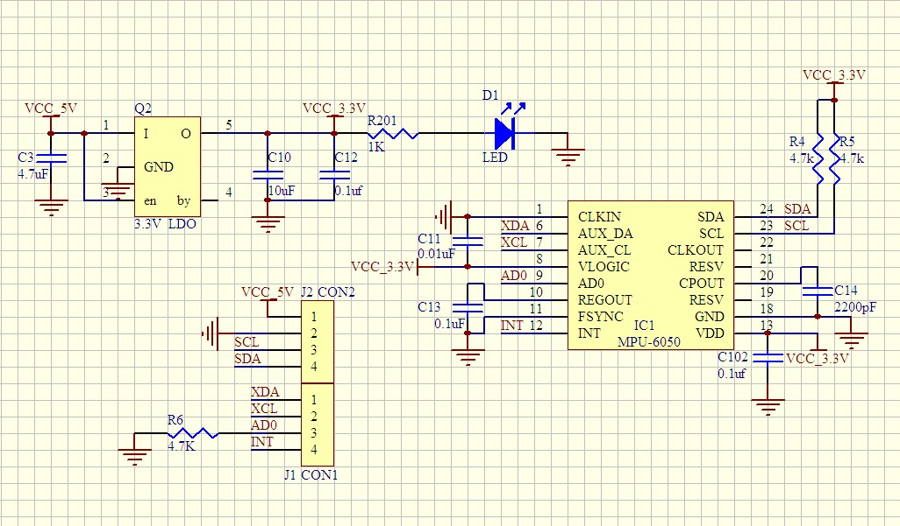

1. I2C通信SCL、SDA：引脚23、24，内置了4.7k的两个上拉电阻。
2. 电源引脚VDD、GND：引脚13、18。
3. 主机I2C引脚XCL、XDA：额外的I2C通信引脚，连接外部磁力传感器，可通过DMP向应用输出完整的9轴融合演算数据。
4. 地址AD0引脚：设置通信中的从机地址，若引脚不接（接地状态）则地址为0x68；若接入高电平，则为0x69。
5. 中断引脚INT：通过设置相应寄存器，可以实现中断的配置。

## 数据采集和传输原理

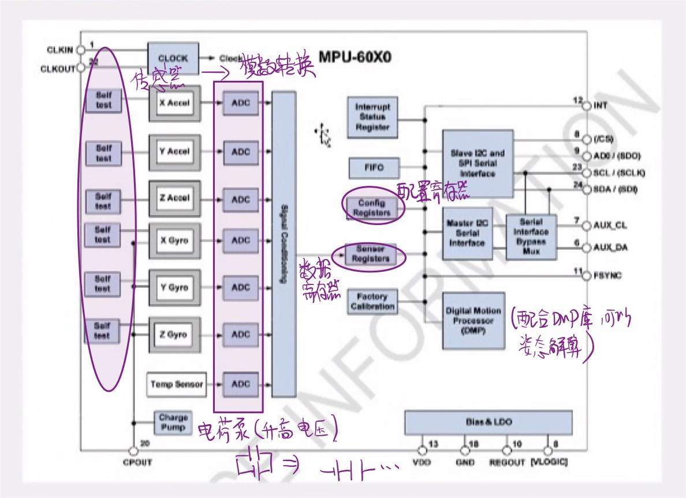

使能后MPU6050进入自测状态(self test)，若满足自测响应值在预设范围内（下式），则可以正常使用。
$$
\mid 使能前的值-使能后的值\mid<\Delta c
$$
之后陀螺仪和角加速度计采集数据，经过ADC模数转换器处理后传到sensor registers，结合DMP可对相应数据解算，得到MPU6050的姿态信息。

# I2C通信协议

## 通讯特点

- **两根通信线**：SCL(serial clock)和SDA(serial data)，通过英文定义我们大概可以知道SCL对应时钟，SDA则与数据传输相关。

- **同步**：同步时序需要一根时钟线指导数据读写，因此它可以支持读写过程中的暂停，对硬件电路的依赖程度比较低；与之对应的**异步时序**则不需要时钟线，节省了部分资源，但是它对数据传输的速率和时间都有十分严格的要求，依赖硬件电路的支持。

- **半双工**：发送和接收数据共用一根线（SDA），可双向传输；而**全双工**需要发送和接收两条线，**单工**则只能单向传输。

- **总线可接入多设备**：一主多从、多主多从。

- **应用**：广泛应用于MPU6050、OLED、AT24CO2等电子模块。

  

## I2C时序

### 基本单元

- 发送一个字节：发送字节时，SCL、SDA全程由主机控制。低电平时主机放数据，高电平时从机读数据。

  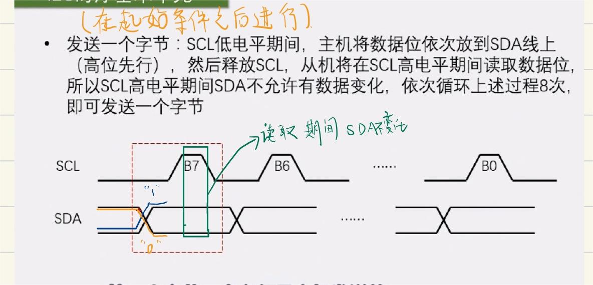

- 接收一个字节：低电平时从机放数据，高电平时主机读数据。

  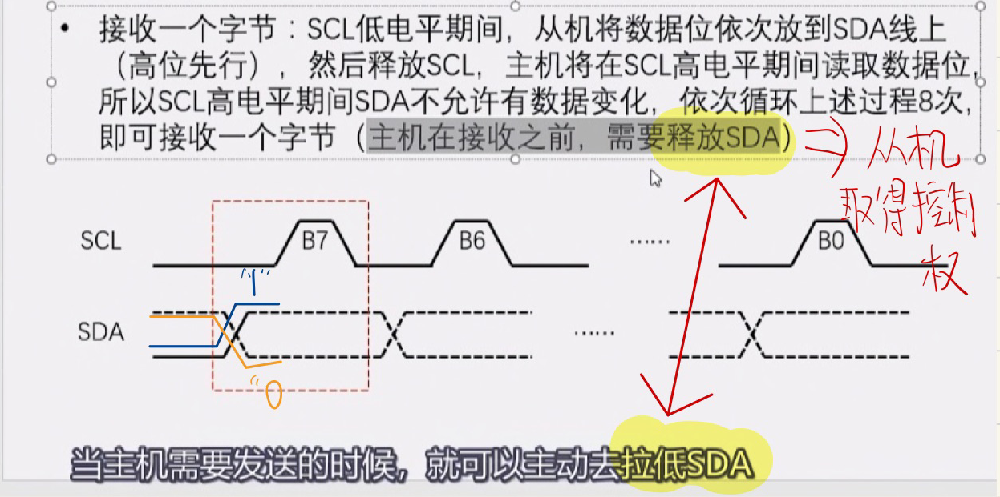

- 发送应答与接收应答：主机接收后发送；主机发送后接收。

  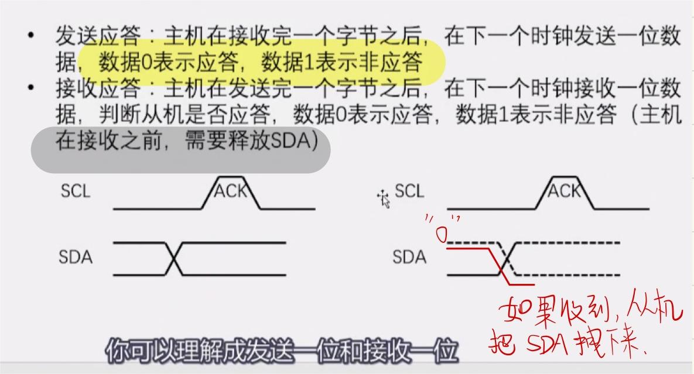        

### 时序实例

- 指定地址写

  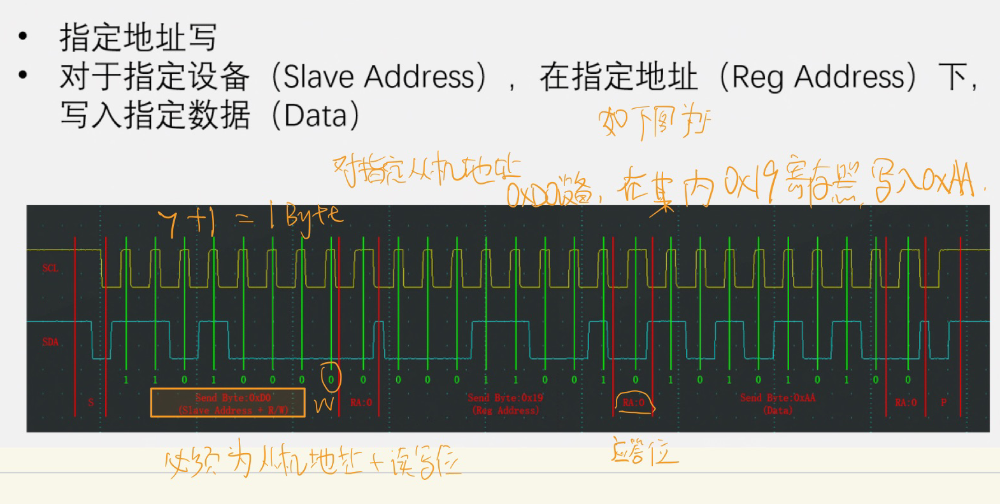

- 当前地址读

  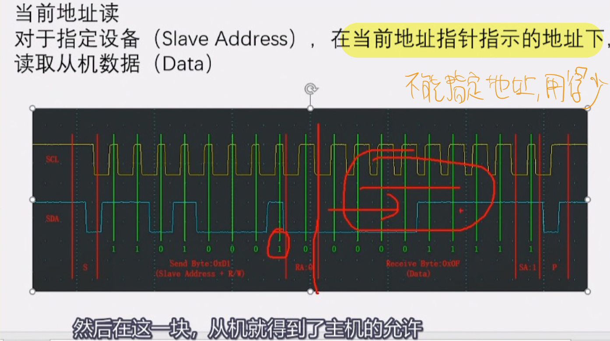

- 指定地址读（复合而成）

  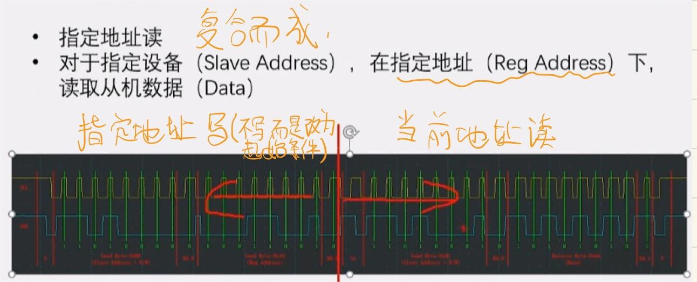

# 软件I2C实现MPU6050数据读写

前面我们提到MPU6050使用的是I2C通信协议，那么就需要找到SCL和SDA引脚，查找STM32F103C8T6引脚定义图可以知道这两个GPIO口分别为PB10、PB11。

## MPU5060寄存器配置

### 采样频率分频器SMPRT_DIV

主要与数据刷新的快慢相关，

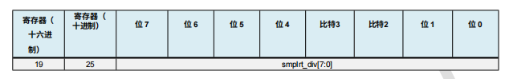

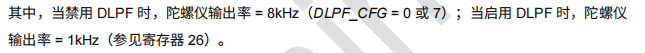

本次实验以陀螺仪晶振为例，不使用8KHz外部晶振，使用1kHz的晶振，故需启用DLPF。

### 配置寄存器CONFIG

主要考虑低通滤波器设置部分，即下图的0-2位。

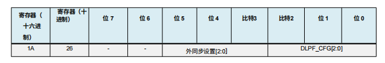

### 陀螺仪配置寄存器GYRO_CONFIG

第5-7位控制陀螺仪的自检（self test）；第3、4位控制满量程的选择，满量程可以根据实际使用进行调节，使得实验数据更加精确。

> 类似于高中电路实验电表的选择？

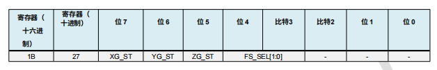

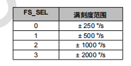


### 加速度计配置寄存器ACCEL_CONFIG

大致与陀螺仪配置寄存器相同，但是0-1位还可以用来配置高通滤波。

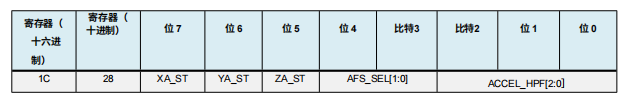

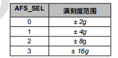


### 数据寄存器（加速度、陀螺仪、温度计等）

​	这几个寄存器类型为只读，可以读取加速度、角加速度、温度等原始信息。

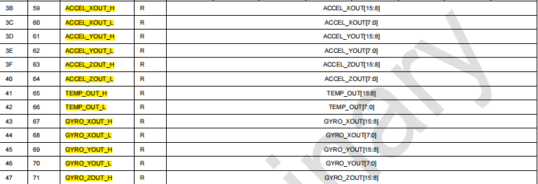


## 库函数代码配置

### SCL、SDA的读写函数

```
//SCL写入
void MyI2C_W_SCL(uint8_t Bitvalue)
{
	GPIO_WriteBit(GPIOB,GPIO_Pin_10,(BitAction)Bitvalue);
	Delay_us(10);
}

//SDA写入
void MyI2C_W_SDA(uint8_t Bitvalue)
{
	GPIO_WriteBit(GPIOB,GPIO_Pin_11,(BitAction)Bitvalue);
	Delay_us(10);
}

//SDA读取
uint8_t MyI2C_R_SDA(void)
{
	uint8_t Bitvalue;
	Bitvalue=GPIO_ReadInputDataBit(GPIOB,GPIO_Pin_11);
	Delay_us(10);
	return Bitvalue;
}
```

### 起始和终止函数

在SCL、SDA读写函数完成后，可以配置I2C通信协议的起止函数驱动：

```
void MyI2C_Start(void)
{
	MyI2C_W_SDA(1);
	MyI2C_W_SCL(1);
	MyI2C_W_SDA(0);//先拉低SDA，后SCL.
	MyI2C_W_SCL(0);
}
void MyI2C_Stop(void)
{
	MyI2C_W_SDA(0);
	MyI2C_W_SCL(1);
	MyI2C_W_SDA(1);
}
```

在开始时先把SCL和SDA都拉高（置1）。考虑到结束时SDA数据并不总是低电平，为重复起始条件，需手动把SDA线先拉低到低电平，再操作SCL线；同样地，终止时SDA不总是低电平，需先将SDA拉低，再将其拉高完成终止操作。

简单来说就是，在SCL时钟线高电平的期间，SDA数据线不能有任何电平的翻转，若SCL时钟线高电平的期间SDA从低电平拉到高电平则重复开始，从高电平拉到低电平则会认为此时发送数据已结束。

### I2C发送与接收数据

```
//发送8字节
void MyI2C_SendByte(uint8_t Byte)
{
	uint8_t i;
	for (i = 0; i < 8; i ++)
	{
		MyI2C_W_SDA(Byte & (0x80 >> i));
		MyI2C_W_SCL(1);
		MyI2C_W_SCL(0);
	}
}

//接收部分
uint8_t MyI2C_ReceiveByte(void)
{
	uint8_t i, Byte = 0x00;
	MyI2C_W_SDA(1);//释放SDA
	for (i = 0; i < 8; i ++)
	{
		MyI2C_W_SCL(1);
		if (MyI2C_R_SDA() == 1){Byte |= (0x80 >> i);}
		MyI2C_W_SCL(0);
	}
	return Byte;
}
```

发送数据时高位先行，发送结束后SCL置低电平；接收数据时同样是高位先行，接收结束后SCL置0。

### 发送与接收应答

```
void MyI2C_SendAck(uint8_t AckBit)
{
	MyI2C_W_SDA(AckBit);
	MyI2C_W_SCL(1);
	MyI2C_W_SCL(0);
}

uint8_t MyI2C_ReceiveAck(void)
{
	uint8_t AckBit;
	MyI2C_W_SDA(1);
	MyI2C_W_SCL(1);
	AckBit = MyI2C_R_SDA();
	MyI2C_W_SCL(0);
	return AckBit;
}
```

主机在接收完一个字节之后，在下一个时钟发送一位数据，数据0表示应答，数据1表示非应答；发送完一个字节之后，在下一个时钟接收一位数据，判断从机是否应答，数据0表示应答，数据1表示非应答（主机在接收之前，需要释放SDA）。

### 读写MPU6050的寄存器

```
//写寄存器
void MPU6050_WriteReg(uint8_t RegAddress,uint8_t Data)
{
	MyI2C_Start();
	MyI2C_SendByte(MPU6050_ADDRESS);
	MyI2C_ReceiveAck();
	MyI2C_SendByte(RegAddress);
	MyI2C_ReceiveAck();
	MyI2C_SendByte(Data);
	MyI2C_ReceiveAck();
	MyI2C_Stop();
}

//读寄存器
uint8_t MPU6050_ReadReg(uint8_t RegAddress)
{
	uint8_t Data;

	MyI2C_Start();
	MyI2C_SendByte(MPU6050_ADDRESS);
	MyI2C_ReceiveAck();
	MyI2C_SendByte(RegAddress);
	MyI2C_ReceiveAck();
	
	MyI2C_Start();
	MyI2C_SendByte(MPU6050_ADDRESS | 0x01);
	MyI2C_ReceiveAck();
	Data=MyI2C_ReceiveByte();
	MyI2C_SendAck(1);
	MyI2C_Stop();
	
	return Data;
	
	
}
```

写寄存器的具体过程是：

1. 开始

2. 主机发送MPU6050地址

3. 收到应答位

4. 发送寄存器地址

5. 收到应答位

6. 发送数据

7. 收到应答位

8. 结束

   每发送一次数据，都要接收相应的应答位，之后继续发送或是停止。

读寄存器过程大致相同，区别只是在于刚开始时要写一下MPU6050设备地址，相当于喊一下MPU6050，告知它我们要和它进行通讯了。

### MPU6050初始化

在完成了MPU6050读写寄存器函数的配置后，我们就可以开始对MPU6050进行初始化。

需要写的寄存器有电源管理寄存器1、2，采样频率分频器，配置寄存器，陀螺仪配置寄存器，加速度配置寄存器。

```
void MPU6050_Init(void)
{
	MyI2C_Init();
	MPU6050_WriteReg(MPU6050_PWR_MGMT_1,0x01);
	MPU6050_WriteReg(MPU6050_PWR_MGMT_2,0x00);
	MPU6050_WriteReg(MPU6050_SMPLRT_DIV,0x09);
	MPU6050_WriteReg(MPU6050_CONFIG,0x06);
	MPU6050_WriteReg(MPU6050_GYRO_CONFIG,0x18);
	MPU6050_WriteReg(MPU6050_ACCEL_CONFIG,0x18);
}
```

### 读取MPU6050数据

通过读取前面所提到的数据寄存器，获取有符号的16位整型加速度、角加速度信息。

```
//也可指定一个基地址，读取连续一片地址
void MPU6050_GetData(int16_t *AccX, int16_t *AccY, int16_t *AccZ, 
						int16_t *GyroX, int16_t *GyroY, int16_t *GyroZ)
{
	uint8_t DataH, DataL;
	
	DataH = MPU6050_ReadReg(MPU6050_ACCEL_XOUT_H);
	DataL = MPU6050_ReadReg(MPU6050_ACCEL_XOUT_L);
	*AccX = (DataH << 8) | DataL;
	
	DataH = MPU6050_ReadReg(MPU6050_ACCEL_YOUT_H);
	DataL = MPU6050_ReadReg(MPU6050_ACCEL_YOUT_L);
	*AccY = (DataH << 8) | DataL;
	
	DataH = MPU6050_ReadReg(MPU6050_ACCEL_ZOUT_H);
	DataL = MPU6050_ReadReg(MPU6050_ACCEL_ZOUT_L);
	*AccZ = (DataH << 8) | DataL;
	
	DataH = MPU6050_ReadReg(MPU6050_GYRO_XOUT_H);
	DataL = MPU6050_ReadReg(MPU6050_GYRO_XOUT_L);
	*GyroX = (DataH << 8) | DataL;
	
	DataH = MPU6050_ReadReg(MPU6050_GYRO_YOUT_H);
	DataL = MPU6050_ReadReg(MPU6050_GYRO_YOUT_L);
	*GyroY = (DataH << 8) | DataL;
	
	DataH = MPU6050_ReadReg(MPU6050_GYRO_ZOUT_H);
	DataL = MPU6050_ReadReg(MPU6050_GYRO_ZOUT_L);
	*GyroZ = (DataH << 8) | DataL;
}

```

需要注意的是，获取器件ID号的部分函数是uint8_t的定义类型，需要单独封装。

```
uint8_t MPU6050_GetID(void)
{
	return MPU6050_ReadReg(MPU6050_WHO_AM_I);
}
```

### 主函数编写

为了检验数据是否能正常采集，在OLED初始化过后，在主函数中调用MPU6050及相关函数，将数据显示到OLED显示屏上面。

```
#include "stm32f10x.h"                 
#include "Delay.h"
#include "OLED.h"
#include "MPU6050.h"

uint8_t ID;
int16_t AX, AY, AZ, GX, GY, GZ;
//分层编写与测验代码

int main(void)
{
	OLED_Init();
	MPU6050_Init();
	
	OLED_ShowString(1, 1, "ID:");
	ID = MPU6050_GetID();
	OLED_ShowHexNum(1, 4, ID, 2);
	
	while (1)
	{
		MPU6050_GetData(&AX, &AY, &AZ, &GX, &GY, &GZ);
		OLED_ShowSignedNum(2, 1, AX, 5);
		OLED_ShowSignedNum(3, 1, AY, 5);
		OLED_ShowSignedNum(4, 1, AZ, 5);
		OLED_ShowSignedNum(2, 8, GX, 5);
		OLED_ShowSignedNum(3, 8, GY, 5);
		OLED_ShowSignedNum(4, 8, GZ, 5);
	}
}

```

具体效果如下图所示：


# 读取数据经蓝牙发送

## 库函数实现USART串口初始化

```
void Serial_Init(void)
{
	RCC_APB2PeriphClockCmd(RCC_APB2Periph_USART1, ENABLE);//开启USART1的时钟
	RCC_APB2PeriphClockCmd(RCC_APB2Periph_GPIOA, ENABLE);//GPIOA时钟使能
	GPIO_PinRemapConfig(GPIO_Remap_USART1,ENABLE);//添加部分，GPIO口复用
	
	GPIO_InitTypeDef GPIO_InitStructure;
	GPIO_InitStructure.GPIO_Mode = GPIO_Mode_AF_PP;//复用推挽输出
	GPIO_InitStructure.GPIO_Pin = GPIO_Pin_9;
	GPIO_InitStructure.GPIO_Speed = GPIO_Speed_50MHz;
	GPIO_Init(GPIOA, &GPIO_InitStructure);
	
	USART_InitTypeDef USART_InitStructure;
	USART_InitStructure.USART_BaudRate = 9600;
	USART_InitStructure.USART_HardwareFlowControl = USART_HardwareFlowControl_None;
	USART_InitStructure.USART_Mode = USART_Mode_Tx;//仅配置接收TX
	USART_InitStructure.USART_Parity = USART_Parity_No;
	USART_InitStructure.USART_StopBits = USART_StopBits_1;
	USART_InitStructure.USART_WordLength = USART_WordLength_8b;
	USART_Init(USART1, &USART_InitStructure);
	
	USART_Cmd(USART1, ENABLE);
}
```

由于蓝牙串口发送暂时不需要RX引脚（即PA10），上面部分代码仅配置了PA9引脚，字长为8字节，停止位1，无校验位。

## 编写串口发送函数

通过查找相应库函数，可以完成发送一个字节的功能。

串口发送的函数其实就是向DR寄存器写入数据，*Data&(uint16_t)0x01FF*实现DR寄存器无关的高位清零；实际发送时，TDR寄存器把数据一位一位地转到移位寄存器中，如果发送过快，可能会产生数据覆写等错误，为了避免产生，我们需要调用函数*FlagStatus USART_GetFlagStatus*获取标志位，直到TXE标志位置*SET*时停止循环。

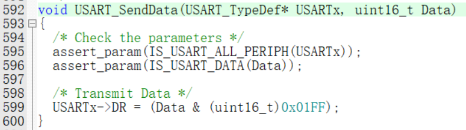

​		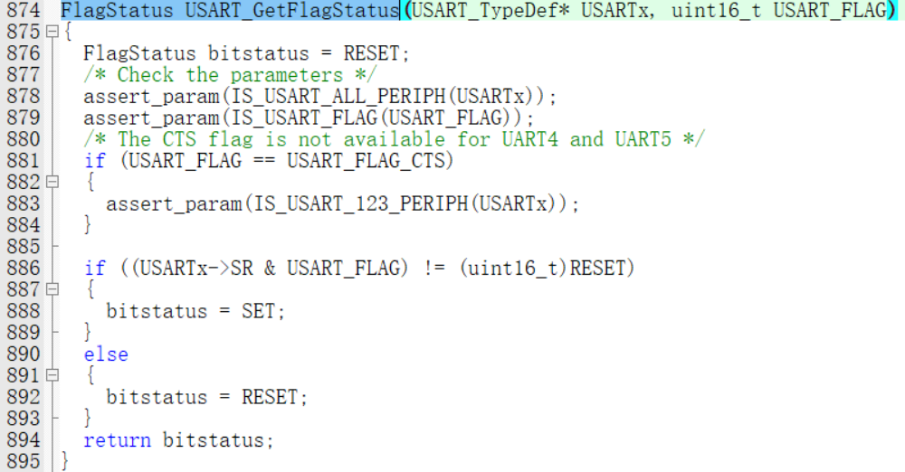

```
//发送一个字节
void Serial_SendByte(uint8_t Byte)
{
	USART_SendData(USART1, Byte);
	while (USART_GetFlagStatus(USART1, USART_FLAG_TXE) == RESET);//再次写入时，标志位自动清零，所以不需要手动
}

```

这样就可以通过*Serial_SendByte()*发送“+”和“-”以及封装发送数据的其他函数，后面r*会用到。

## printf函数的重定向

通过printf函数的重定向，我们可以实现printf打印输出串口数据，当然使用封装*Serial_SendByte*的*Serial_SendString*也可以达到目的。

注意加上头文件*include <stdio.h>*。

```
//对printf函数进行重定向，以使用printf
int fputc(int ch, FILE *f)
{
	Serial_SendByte(ch);
	return ch;
}

```

## 封装MPU6050数据发送函数

之前我们已经实现了OLED显示屏上打印读取的ACC和GYRO数据，其中如何将一串有符号数字打印出来呢？

可以参考一下以下库函数代码的思路：

对于一个多位数12345，12345/10000%10=1，12345/1000%10=2，12345/100%10=3，12345/10%10=4，也就是说我们可以通过整除和取余相结合，一个一个地取出类似的多位数的每一位。

下列*OLED_Pow*函数可以实现X的Y次方的计算，之后循环取出每一位就可以打印出数据。


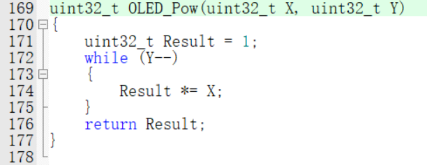

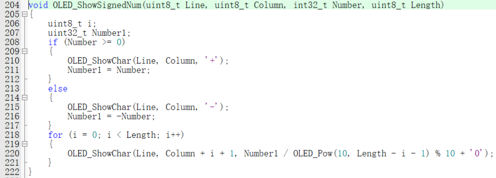

```
//次方函数
uint32_t Serial_Pow(uint32_t X, uint32_t Y)
{
	uint32_t Result = 1;
	while (Y --)
	{
		Result *= X;//X^Y
	}
	return Result;
}
//发送ACC、GYRO数据
void serial_print_MPU6050data(int32_t Number, uint8_t Length)
{
	uint8_t i;
	uint32_t Number1;
	if (Number >= 0)
	{
		Serial_SendByte( '+');
		Number1 = Number;
	}
	else
	{
		Serial_SendByte( '-');
		Number1 = -Number;
	}
	for (i = 0; i < Length; i++)							
	{
		Serial_SendByte(Number1 / Serial_Pow(10, Length - i - 1) % 10 + '0');
		//“/10”实现取左边，“%10”实现取右边；为了以字符形式一串行地显示，加上偏移'0'
	}
	printf("\r\n");//回车换行
}
```

## 主函数编写

```
int main(void)
{
	MPU6050_Init();
	Serial_Init();
	
	
	while (1)
	{
		MPU6050_GetData(&AX, &AY, &AZ, &GX, &GY, &GZ);
		printf("ACC:\r\n");
		serial_print_MPU6050data(AX,6);
		serial_print_MPU6050data(AY,6);
		serial_print_MPU6050data(AZ,6);
		printf("GYRO:\r\n");
		serial_print_MPU6050data(GX,6);
		serial_print_MPU6050data(GY,6);
		serial_print_MPU6050data(GZ,6);
		Delay_ms(1000);//延时1秒
	}
}
```

最后在手机端蓝牙调试助手实现收发。

