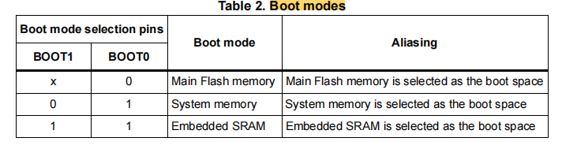
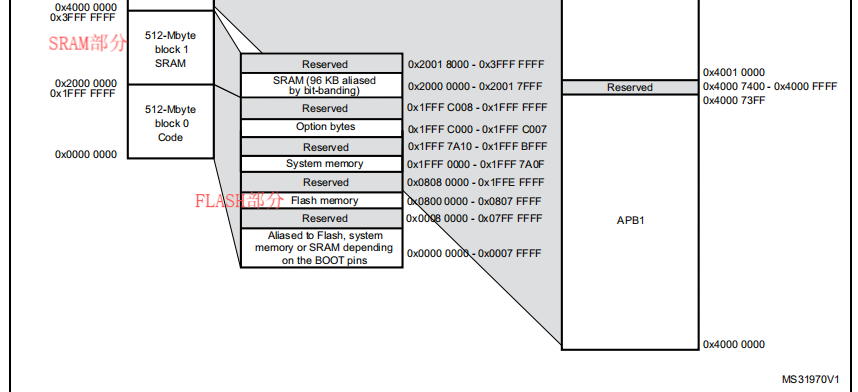
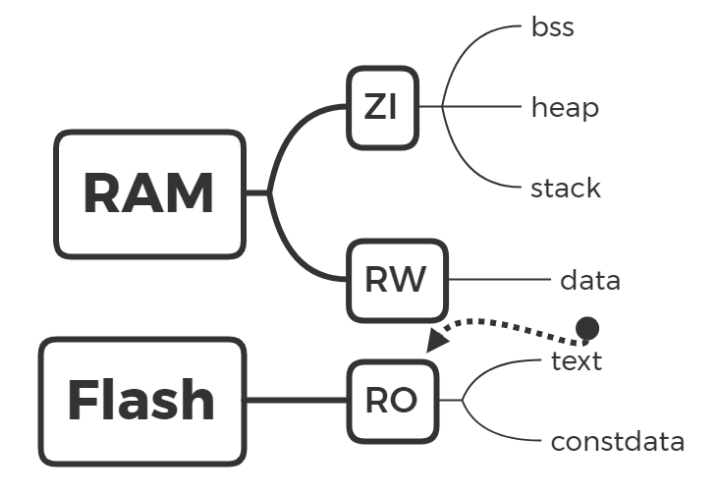
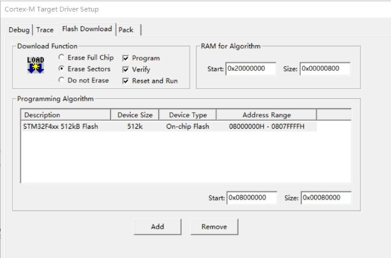
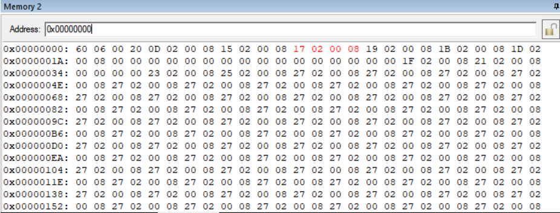
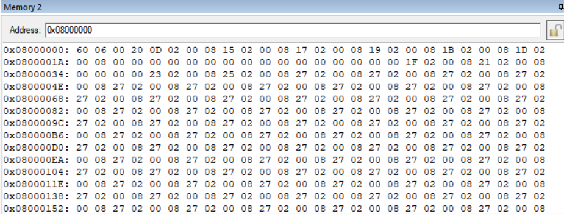
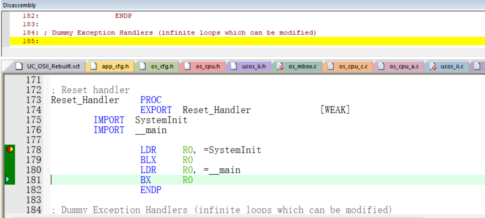

+++
title = 'Stm32学习小记（三）——STM32_Cortex M启动流程详解'
date = 2025-03-24T00:31:15+08:00
draft = true

+++

## 启动模式

stm32有多种启动模式，以STM32F4XX为例，如下图所示：



> 并非所有芯片都适用于这个表格，不同型号具体启动方式请参考对应手册,官方也有Bootloader介绍文档可以查看。


### 第一种启动方式

最常用的用户FLASH启动，正常工作就在这种模式下，STM32的FLASH可以擦除10万次，所以不用担心芯片哪天会被擦爆。

### 第二种启动方式

系统存储器启动方式，使用串口下载程序或者使用USB-DFU模式下载程序，不建议使用这种，速度比较慢。STM32 中自带的BootLoader就是在这种启动方式中，如果出现程序硬件错误的话可以切换BOOT0/1到该模式下重新烧写Flash即可恢复正常。

### 第三种启动方式

STM32内嵌的SRAM启动，一般该模式用于调试。 用J-Link在线仿真，则是下载到SRAM中。


## 启动文件

### 内存分布

STM32的数据在物理上分别储存在RAM和Flash中。

RAM可读可写，**掉电清零**。Flash可读可写，但是读写时间很长，能**掉电储存**，并且一般空间比RAM大很多。

下图是STM32F4XX的Memory Map,可以看到，其FLASH起始地址为0x0800 0000,大小为512KB





那么FLASH和RAM主要存储哪些数据呢？这里又涉及到了**６个储存数据段**和**３种储存属性区**的概念，可以参考[这篇博客](https://blog.csdn.net/xingqingly/article/details/120260398)。



#### ６个储存数据段

**data**
数据段，储存已初始化的，且初始化不为0的全局变量和静态变量。

**bss**
Block Started by Symbol。储存未初始化的，或初始化为0的全局变量和静态变量。

```c
int c;//这里c会被放入BSS区域，后续会对其赋初始值为0
```

**text**
用户的代码段，储存程序代码。

**constdata**
储存只读常量。

**heap**
堆，存放进程运行中被动态分配的内存段。其可用大小定义在启动文件startup_stm32fxx.s中，由程序员使用malloc()和free()函数进行分配和释放。

**stack**
栈，其大小定义在启动文件startup_stm32fxx.s中，由系统自动分配和释放。可存放局部变量、函数的参数和返回值，中断发生时能保存现场。但是static声明的局部静态变量不储存在栈中，而是放在data数据段。

#### 3种储存属性区

**RO(Read Only)**
烧写到Flash中，可以长久保存。text代码段和constdata都属于RO。由于需要掉电储存，RO里也保存了一份data的数据。

**RW(Read Write)**
储存在RAM中。data属于此区。上电时单片机会将Flash中保存的data类型数据复制到RAM中，以供读写使用。

**ZI(Zero Init)**
零初始化区，同样储存在RAM里。系统上电时会把此区域的数据进行0初始化。bss，heap，stack均属于这个区域。

#### 小结

链接时记录bss段大小，装载（后续会提到）时分配空间

FLASH：Code + RO-Data + RW-Data（运行时搬运到RAM里面）

SRAM： RW-Data + ZI-Data


### 代码详解

打开startup_stm32f40_41xxx.s文件，我们可以查看详细启动文件代码。

```assembly
Stack_Size      EQU     0x400

                AREA    STACK, NOINIT, READWRITE, ALIGN=3
Stack_Mem       SPACE   Stack_Size
__initial_sp
```

分配了一段大小为1KB的栈空间，段名STACK，可读写，ALIGN=3表示2^3=8字节对齐，"_ _initial_sp"紧挨着栈的结束地址，由于栈是从高往低生长，所以"__initial_sp"的位置就是栈顶。

```assembly
Heap_Size      EQU     0x200

                AREA    HEAP, NOINIT, READWRITE, ALIGN=3
__heap_base
Heap_Mem        SPACE   Heap_Size
__heap_limit
```

分配了一段大小为512字节的堆空间，段名HEAP，可读可写，8字节对齐，__heap_base和__heap_limit分别是堆的起始地址和结束地址。

```assembly
                PRESERVE8
                THUMB
```

指定当前文件的堆栈按照8字节对齐，后面指令兼容16位的Thumb指令。Cortex-M内核实际使用的是Thumb-2指令集，将16位与32位指令混合使用。

```assembly
                AREA    RESET, DATA, READONLY
                EXPORT  __Vectors
                EXPORT  __Vectors_End
                EXPORT  __Vectors_Size

__Vectors       DCD     __initial_sp               ; Top of Stack
                DCD     Reset_Handler              ; Reset Handler
                DCD     NMI_Handler                ; NMI Handler
                DCD     HardFault_Handler          ; Hard Fault Handler
                DCD     MemManage_Handler          ; MPU Fault Handler
                DCD     BusFault_Handler           ; Bus Fault Handler
                DCD     UsageFault_Handler         ; Usage Fault Handler
                DCD     0                          ; Reserved
                DCD     0                          ; Reserved
                DCD     0                          ; Reserved
                DCD     0                          ; Reserved
                DCD     SVC_Handler                ; SVCall Handler
                DCD     DebugMon_Handler           ; Debug Monitor Handler
                DCD     0                          ; Reserved
                DCD     PendSV_Handler             ; PendSV Handler
                DCD     SysTick_Handler            ; SysTick Handler

                ; External Interrupts
                DCD     WWDG_IRQHandler                   ; Window WatchDog
                DCD     PVD_IRQHandler                    ; PVD through EXTI Line detection
                …………
                DCD     0                                 ; Reserved
                DCD     SPI4_IRQHandler                   ; SPI4

__Vectors_End

__Vectors_Size  EQU  __Vectors_End - __Vectors

```

定义了一个数据段，名为DATA，仅可读。

上文为堆栈分配的空间均位于SRAM中，不占用代码空间，从这个数据段开始才是stm32代码空间的起始位置，先定义并初始化了栈顶位置（_ _initial_sp）以及15个内核异常处理函数的入口地址，接下来是外部中断，最后用结束地址减去开始地址得到__Vectors_Size即本数据段的大小。

```assembly
Reset_Handler    PROC
                 EXPORT  Reset_Handler             [WEAK]
        IMPORT  SystemInit
        IMPORT  __main

                 LDR     R0, =SystemInit
                 BLX     R0
                 LDR     R0, =__main
                 BX      R0
                 ENDP
```

reset_handler即复位程序的实际执行代码，上电或是复位都会先从这里开始执行然后进入main函数，具体的执行过程暂且按下不表，我们继续看启动文件的后续内容。

```assembly
NMI_Handler     PROC
                EXPORT  NMI_Handler                [WEAK]
                B       .
                ENDP
HardFault_Handler\
                PROC
                EXPORT  HardFault_Handler          [WEAK]
                B       .
                ENDP   
…………

SysTick_Handler PROC
                EXPORT  SysTick_Handler            [WEAK]
                B       .
                ENDP

Default_Handler PROC

                EXPORT  WWDG_IRQHandler                   [WEAK]                         
                EXPORT  PVD_IRQHandler                    [WEAK]                      
                EXPORT  TAMP_STAMP_IRQHandler             [WEAK]  
                …………
                EXPORT  SPI4_IRQHandler                   [WEAK]
                
WWDG_IRQHandler                                                       
PVD_IRQHandler                                      
TAMP_STAMP_IRQHandler
…………
SPI4_IRQHandler
           
                B       .

                ENDP

                ALIGN
```

将除了reset_handler外的内核异常都分别写成无限循环（B .）的弱函数，外部中断也是如此，只是函数起始位置都是同一个地址。

```assembly
                 IF      :DEF:__MICROLIB
                
                 EXPORT  __initial_sp
                 EXPORT  __heap_base
                 EXPORT  __heap_limit
                
                 ELSE
                
                 IMPORT  __use_two_region_memory
                 EXPORT  __user_initial_stackheap
                 
__user_initial_stackheap

                 LDR     R0, =  Heap_Mem
                 LDR     R1, =(Stack_Mem + Stack_Size)
                 LDR     R2, = (Heap_Mem +  Heap_Size)
                 LDR     R3, = Stack_Mem
                 BX      LR

                 ALIGN

                 ENDIF

                 END
```

如果使用了microlib则将栈顶地址和堆的起始、结束地址export出去，microlib会进行堆栈初始化的操作，若是没有使用，则堆栈初始化时会使用__user_initial_stackheap函数。


## 启动流程

### 地址映射

STM32的代码是烧写到flash中的，通过查询手册可知，STM32F401XX的flash的起始地址是0x08000000；当然通过KEIL已配置好的工程也能查看flash信息：



但是Cortex-M内核规定上电后必须从0x00000000的位置开始执行，这就需要一个**地址映射**的操作，不论stm32的启动模式是本文开头说的哪一种，都会将该启动区域的代码映射到0x00000000的位置，进入keil的调试模式打开memory窗口，输入查看0x00000000和0x08000000：





我们可以发现数据是完全相同的。

通过地址映射机制，同一份代码可通过硬件配置在不同启动模式下运行，用户不需要关心物理地址的具体位置，只需使用链接脚本将代码和数据分配到正确的地址区域。例如，中断向量表默认放在Flash的起始位置，但通过VTOR寄存器可以重定位到SRAM，这种灵活性在调试或需要动态加载代码时非常有用，从而提高了开发效率

### 硬件自动为MSP和PC赋值,开始执行reset_handler

分析启动代码时我们提到过，从DATA段开始才是代码段的起始位置，那么0x08000000作为起始地址的4字节空间存储的就是__initial_sp的地址，即栈顶地址，上电或复位后，硬件会自动将该地址赋给**MSP**，即主栈指针，随后将0x08000004作为起始地址的4字节空间内容，也就是reset_handler函数入口地址赋给**PC**。

此时程序会立刻去执行**reset_handler**，让我们回过头来看看reset_handler中做了些什么：

```assembly
Reset_Handler    PROC
                 EXPORT  Reset_Handler             [WEAK]
        IMPORT  SystemInit
        IMPORT  __main

                 LDR     R0, =SystemInit
                 BLX     R0
                 LDR     R0, =__main
                 BX      R0
                 ENDP
```

可以看到，reset_handler中执行了两个程序，**SystemInit**和**__main**。

### System_Init

不同型号芯片的默认systeminit函数有所区别，内容往往是初始化时钟、FPU等。

用户没有重写"_ _main"的情况下，该函数并不在库文件中，而是由armlink创建，如果想要在keil调试的时候查看__main的具体执行过程，需要在BX R0指令运行前点击汇编代码的内容框，再继续单步执行，则可以看到 _ _main的汇编代码，否则会直接跳进main函数。



### __main

_ _main中调用了 _ _scatterload和 _ _rt_entry两个函数：

##### __scatterload(分散加载)

默认的__scatterload函数做了两件事：

1.将ZI段数据全部初始化为0

2.将“非根区域”的数据从加载域复制到执行域（将可读可写的数据搬运到RAM）

在keil工程目录下的${工程名}.sct文件中可以查看加载域和执行域的地址以及数据存储位置：

```assembly
; *************************************************************
; *** Scatter-Loading Description File generated by uVision ***
; *************************************************************

LR_IROM1 0x08000000 0x00080000  {    ; load region size_region
  ER_IROM1 0x08000000 0x00080000  {  ; load address = execution address
   *.o (RESET, +First)
   *(InRoot$$Sections)
   .ANY (+RO)
   .ANY (+XO)
  }
  RW_IRAM1 0x20000000 0x00018000  {  ; RW data
   .ANY (+RW +ZI)
  }
}
```

可以看到，加载域的地址就是flash的地址，且只读的数据（RO、XO）放在flash（0x08000000--0x08080000）中，可读可写的数据（RW、ZI）放在RAM（0x20000000--0x20018000）中。

##### __rt_entry

_ _scatterload函数执行完后接着调用 _ _rt_entry， _ _rt_entry又调用了如下函数：

```
_platfoem_pre_stackheap_init

__user_setup_stackheap **or** setup the Stack Pointer(SP) by another method

_platfoem_post_stackheap_init

__rt_lib_init

_platfoem_post_lib_init

main()

exit()
```

其中__user_setup_stackheap就是启动文件末尾的函数，如果没有使用microlib的话就会调用它。

__rt_entry负责初始化堆栈以及C语言库子系统，即C语言代码运行所必需的环境，随后万事俱备，就可以跳入main函数执行C语言代码了。

当然，如果没有在main函数中写死循环的话，main函数执行完了后会到达exit退出程序。


## 总结

总结一下，芯片上电第一件事是把代码空间的第一行，即**栈顶指针**赋给msp，随后将第二行reset_handler的**入口地址**赋给pc，使程序立刻跳转去执行**reset_handler**，在reset_handler中先初始化时钟、FPU等硬件相关配置（具体内容根据芯片型号有所不同），再初始化ZI段，将代码和数据从加载域**搬运**到执行域，随后初始化堆栈和C语言库子系统，使得C语言代码能够正常运行，最后跳入**main函数执行**用户编写的C程序。

