+++
title = 'Stm32学习小记（二）——应用AD绘制原理图'
date = 2024-10-22T22:32:37+08:00
draft = true

+++

## 创建工程

一个完整的PCB工程应该包含lib、schdoc、pcbdoc,在本节我们先学习绘制schlib即原理图。

创建之后的文件目录参考：

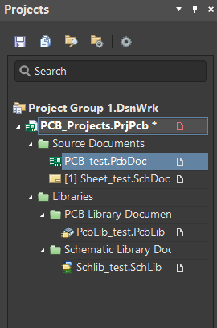

尽量避免直接打开上述单个文件，可以打开.PrjPcb项目文件

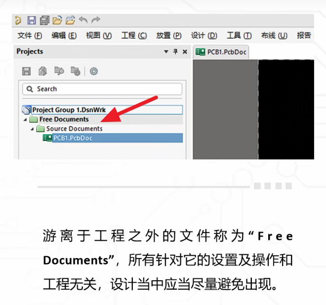

### 元件符号

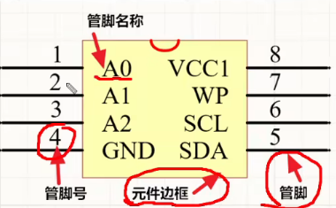

格点大小：

一般管脚设置成100mil,图形元素格点为10mil

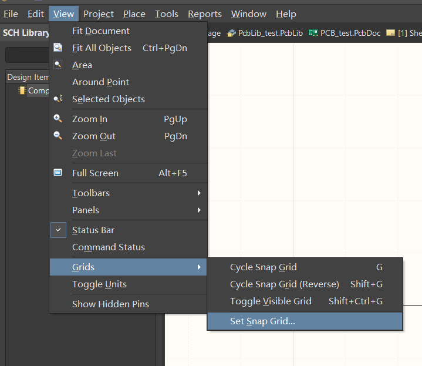

## 简单元器件的绘制(自制原理图库)

**原理图库只是实物器件在图纸上的表示，无需和实物尺寸一样**

### 电容(CAP)

Designator:C?

Comment:容量

Description:其余描述

### 电阻(RES)

Designator:R?

Comment:容量

Description:其余描述

Add footprint:添加封装

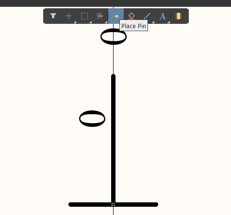

右侧Properties中设置各类参数：

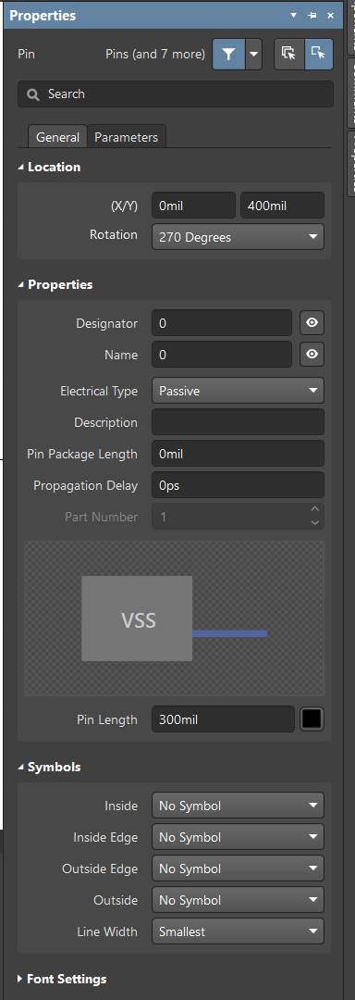

### 二极管(DIO)

发光二极管LED

Designator:D?

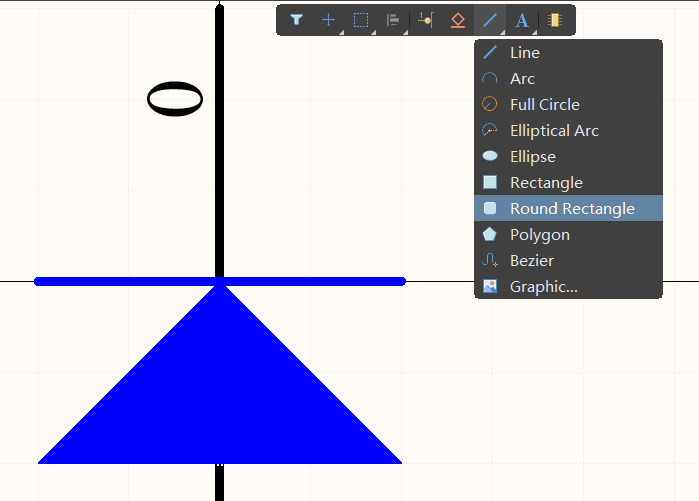

绘制特殊图形如圆形、多边形。

通过line shape，可以设置为箭头形式，同理可以在line设置其颜色等。

之后按住shift拖动，可以复制箭头图像。

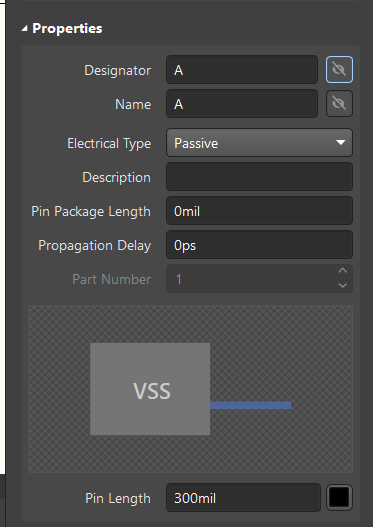

A表示正极，一般不显示；同理K表示负极。

### 运放

具体器件具体命名

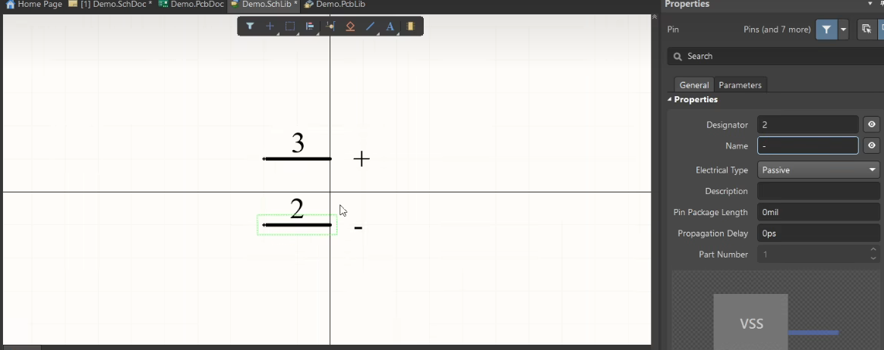

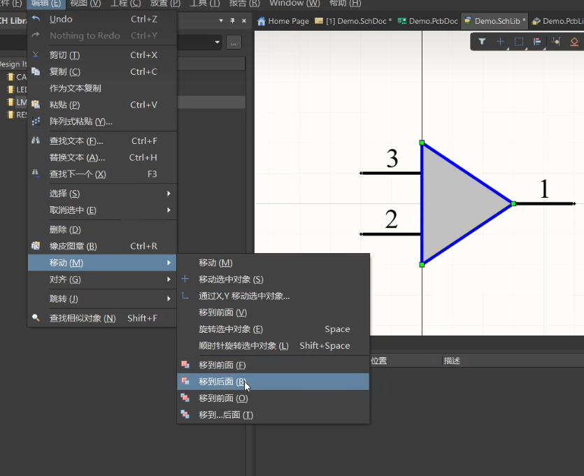

将+、-移动到三角形内部。

一个器件可以有多个part

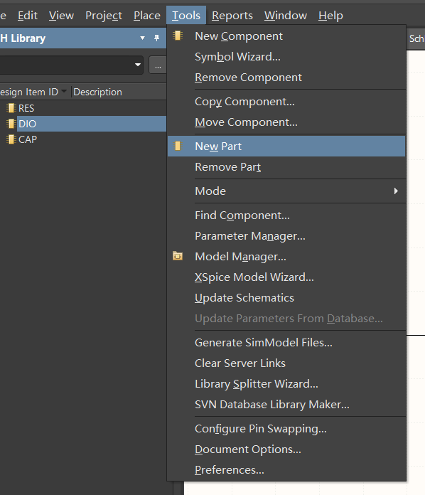

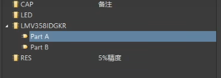

## 原理图库的调用

### 其他库中调用

在他人的原理图库中，可以调用元器件

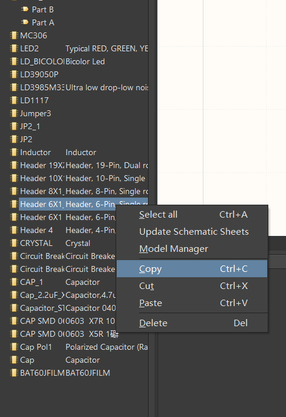

复制后粘贴到自己的SCH Library

### 导入外部库

**.intlib**

集成库，既有原理图库，也有封装

**.schlib**

仅原理图库

**.pcblib**

仅封装库

一般来说，AD软件下载安装后会自带两个库，但是不能满足我们的需求，比如在绘制STM32F4系列时，我们需要用到F4的库，网上找了很多，但是直接导入.intlib最为省事，这里给出了github上的一个文件：[下载地址](https://github.com/ryankurte/altium-library/blob/master/third_party/STMicroelectronics STM32 F4.IntLib)

总结：

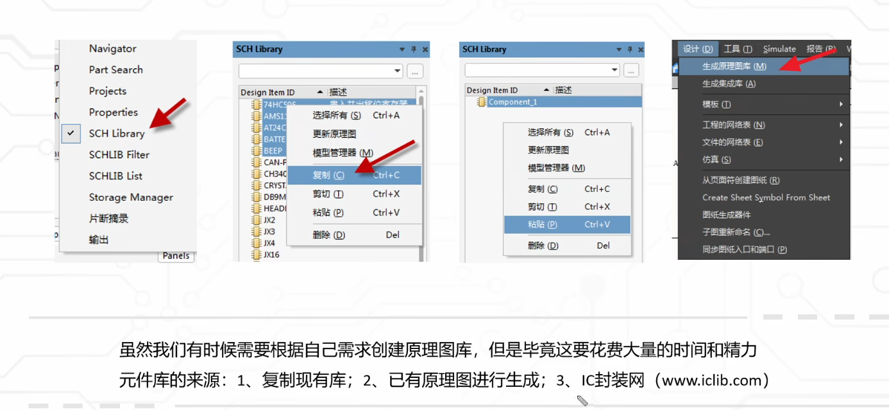

## 原理图库的正确性检查

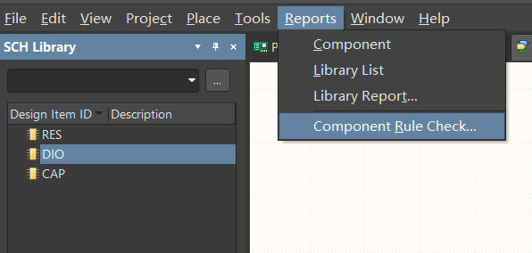

勾选后自动检查并生成报告

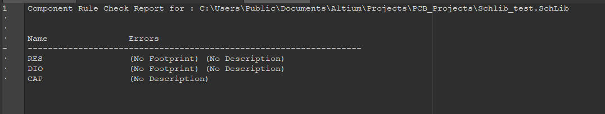

可能的报错类型:

## 原理图的绘制

这里我们以STM32F401RET6为例，尝试简单绘制一下原理图

### 页面调整

双击原理图边缘进入属性面板，可调整纸张尺寸，网格大小，隐藏表头和边框

设计(D) -> 模板(T) -> 本地(L) 可调用官方的原理图预设模板

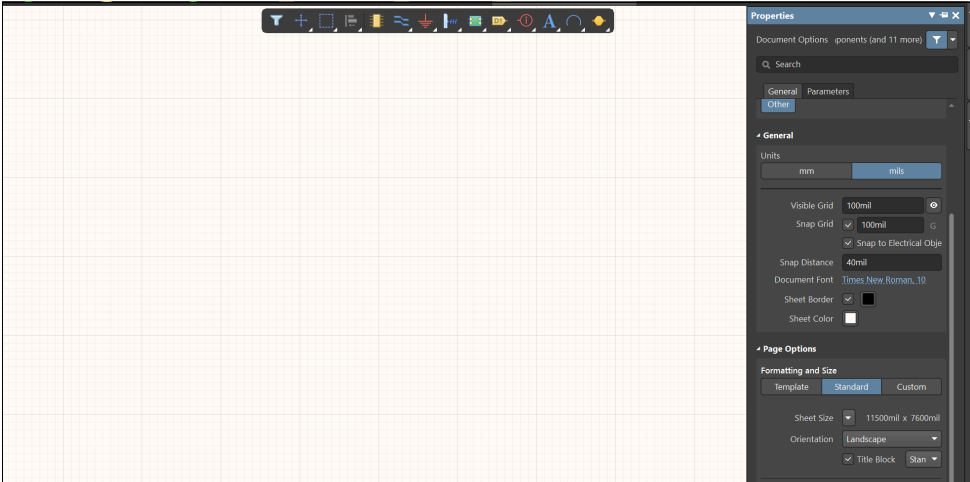

### 芯片绘制

在DataSheet-f401re手册中，我们找到芯片的引脚描述

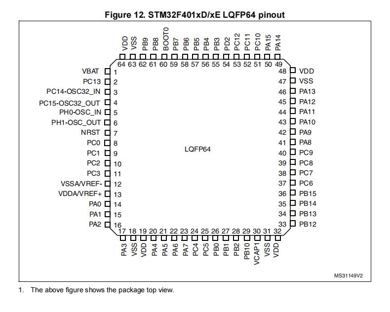

UFQFPN48、LQFP64、LQFP100是集成电路的不同封装类型，其中我们使用的属于LQFP64封装

再在.schlib中绘制芯片并放置引脚，右上角properities-->pins可以统一设置引脚名称、编号以及参数。

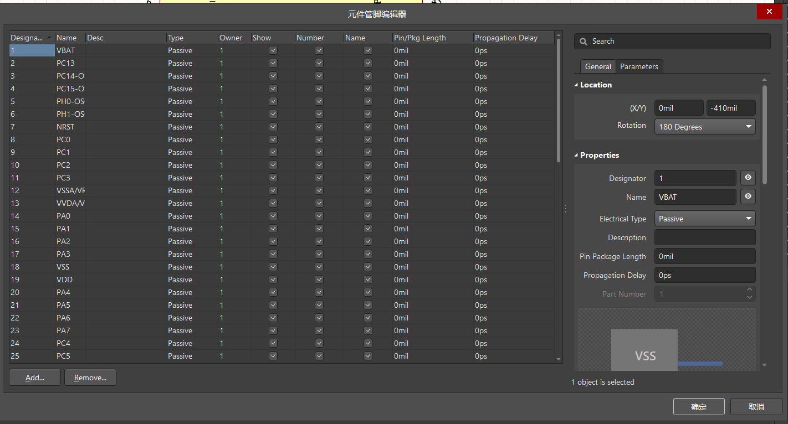

### 芯片引脚分类以及“最小系统”

电源——(VBAT)(VDD,VSS)(VDDA,VSSA)(VREF+,VREF-)等

晶振IO——主晶振IO，RTC晶振IO

下载IO——用于JTAG下载的IO：JTMS，JTCK，JTDI，JTDO，NJTRST 

BOOT IO——BOOT0，BOOT1，用于设置系统的启动方式

复位IO——NRST，用于外部复位

GPIO——通用输入输出

前五部分IO组成的系统叫做**最小系统**

 

### 接线与网络标签

为了使连线更加简洁，不易交错，一般采用**网络标签**

两个相同名称的网络标签默认连接端口，离图连接器等网络标识符可以可表示图之间的网络连接

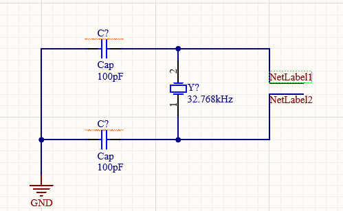

（按住Alt，鼠标单击某个网络标签，就能看到相同的网络标签对应高亮显示）

### 整体修改编号

全部元件放入后可整体编号，使每个元件都有标号且不冲突即可

工具(T) -> 标注(A) -> 原理图标注(A）

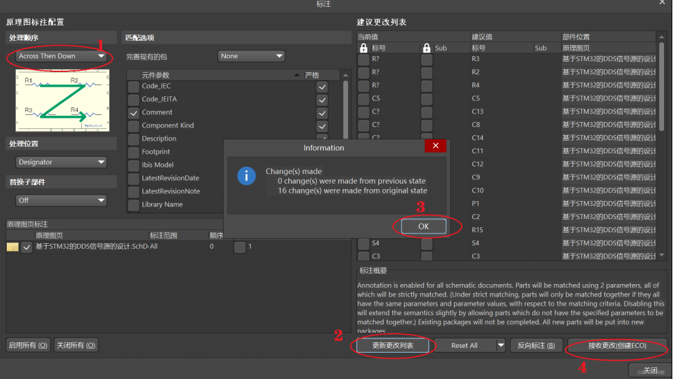

### 划分区块

为了使原理图简便易读，可以用线条将其划分成多个模块，后续设计PCB图时也能有帮助。

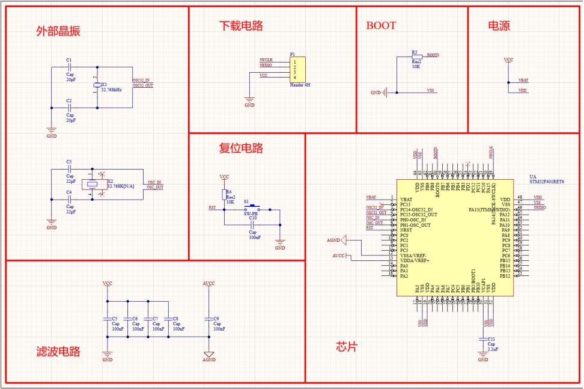

### 封装统一管理

工具(T) -> 封装管理器(G) ，可统一添加封装。

接收变化 -> 验证变更 -> 执行变更

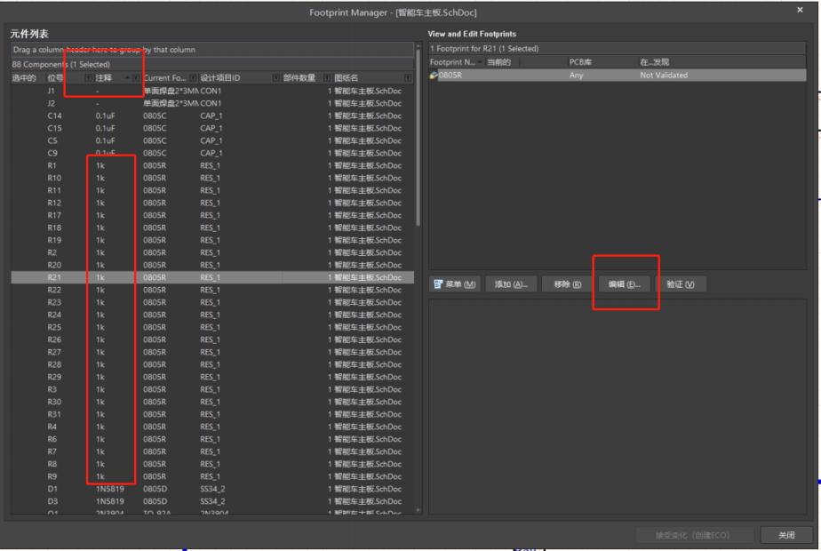

### 编译原理图

工程右键->工程选项(O) 可查看原理图规则设置

集中检查以下对象，可将其配置为错误(只有警告视为编译通过，不会报错)

1. Floating net labels 悬浮的网络标签

2. Floating power objects 悬浮的电源端口

3. Nets with multiple names 重复的网络标签

4. Nets with only one pin 单端网络

5. Un-Designated parts requiring annotation 需要注释的未指定文件

6. Duplicate Part Designators 重复的元件位号

项目(C) ->Validate PCB Project，编译原理图，原理图设计不合理处(走线悬空，元件之间堆叠等)，会出

现报错，可根据软件的报错信息定位报错位置，做出相应的修改。

### 原理图打印

文件(F) -> 智能PDF(M) 进入PDF创建下载

选择输出文档范围，是否对BOM表(物料清单)进行输出，参数设置

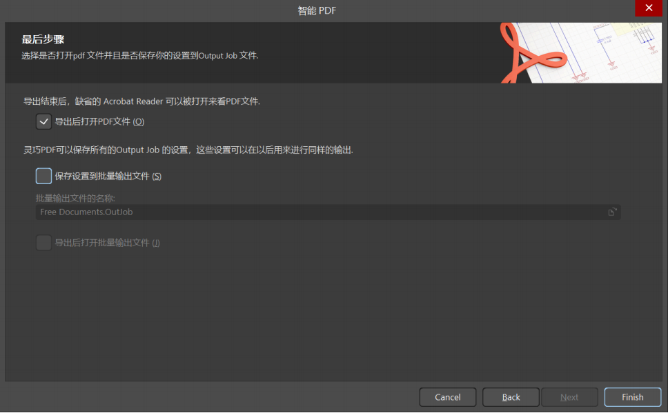