+++
title = '四轴飞行器综合设计之转接板绘制'
date = 2025-03-30T15:59:21+08:00
draft = true

+++

# 四轴飞行器转接板设计

整体大致的思路：选材->布局->绘制->验证->调整->测试

## 选材

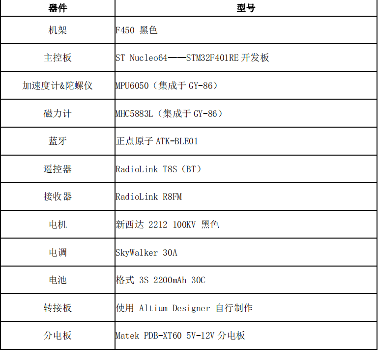

遥控器和接收机的选择原因：

1. 对应的接收机支持PPM总线输出，通信抗干扰能力强，同时能实现飞控板单排线输入，简化连线，减轻整机重量；
2. 便于后续解析数据。将接收机的输出端口与 STM32F401RE 主控板的 GPIO 接口连接，便可将遥控器信号转换后的电信号送入 F401 进行处理。                        

​	

> 什么是PPM信号：将多个通道的PWM放到一条数据帧上进行传输，具体可以参考[PWM信号与PPM信号辨析](https://blog.csdn.net/qq997758497/article/details/102942248)
>
> 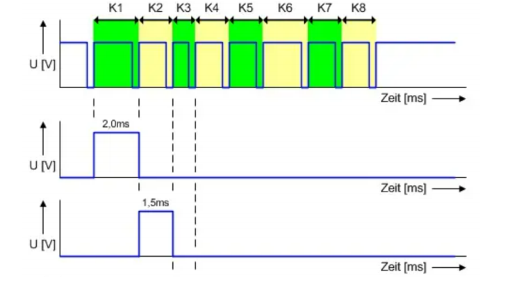

## 布局

可以选择单层转接板或者双层转接板，

- 双层（上下两层）的优势在于可以充分预留模块的空间，缺点是设计时加大了工作量，不一定能保证整体的美观性；

- 单层的优势在于设计较为方便，安装拼接方便，缺点在于各模块空间有限，需要综合考虑布局（三维空间上）。

  

  我们最后选择了单层转接板，结合意法半导体官网给出的尺寸图纸，大致拟定好了转接板上各个模块的布局

  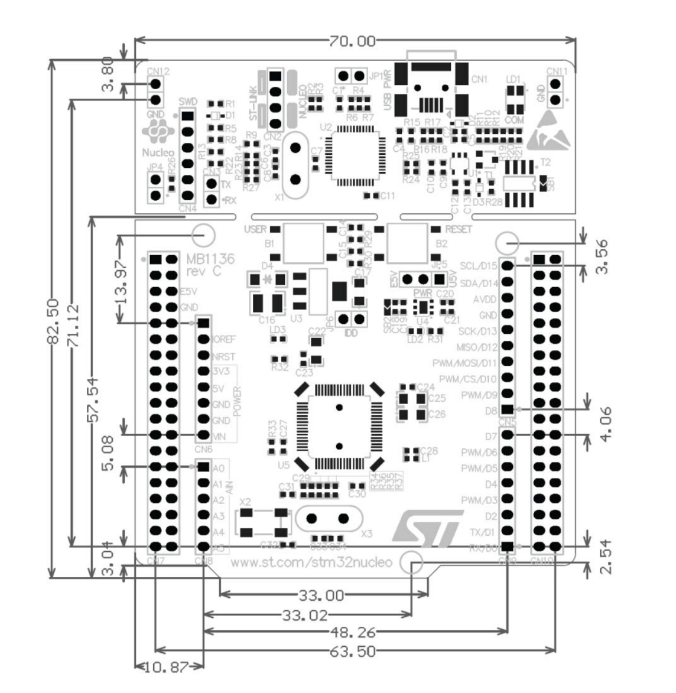

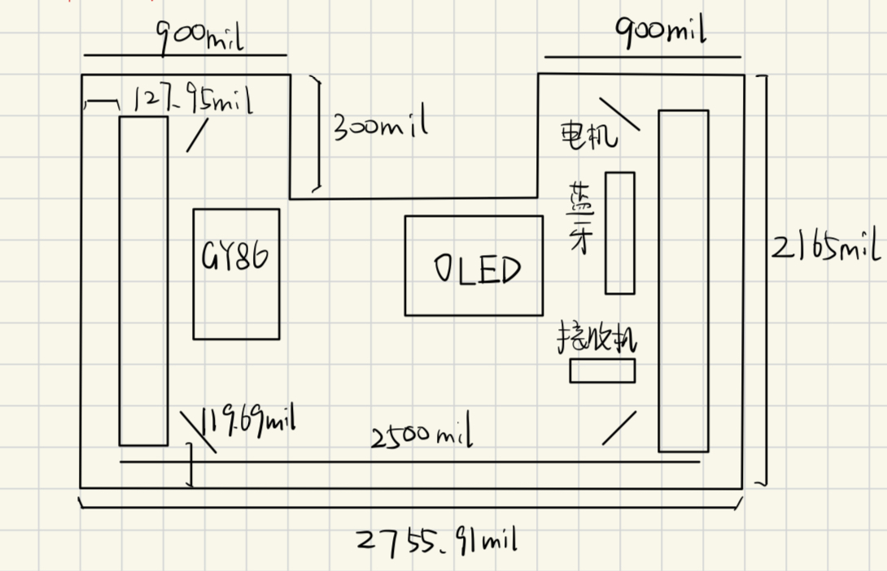

### 数据线

我们先规划引脚的复用，在这里有很多种方式，可以使用STM32CubeMX,也可以按照官方引脚图手动分配。为了更贴近实际引脚位置，我们考虑第二种方法。

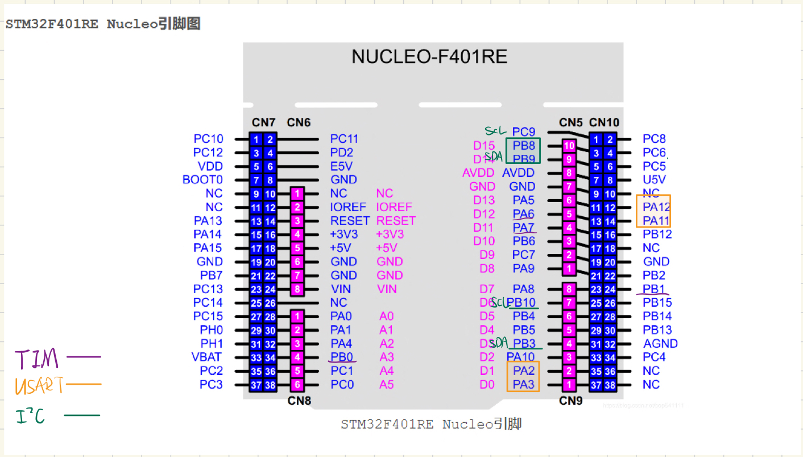

| 协议  |      引脚号       |             备注              |
| :---: | :---------------: | :---------------------------: |
|  TIM  |  PB0,PB1,PA6,PA7  |        通用定时器TIM3         |
| USART | PA2,PA3 PA11,PA12 | USART2,USART6  蓝牙和串口调试 |
|  IIC  | PB8,PB9  PB10,PB3 |     IIC1,IIC2 OLED和GY86      |

### 电源系统

#### 模块供电

根据 User Manual-Nucleo F401RE 手册以及该开发板的原理图，共有三种供电方式：USB 供电（U5V)、外部供电（E5V）以及外部供电（7V～12V,VIN）。我们选择了外部供电（5V）和USB供电相结合的方案：

- 调试时U5V给板子上电，之后开发板通过+5V和+3.3V给各个模块供电。

- 组装集成系统时将跳线帽 JP5 移动至左侧两针脚（E5V)；开发板上电后进而给模块供电。

  

  > 两种方式本质上只是给STM32开发板的供电方式不同，模块的电源通路并无区别。

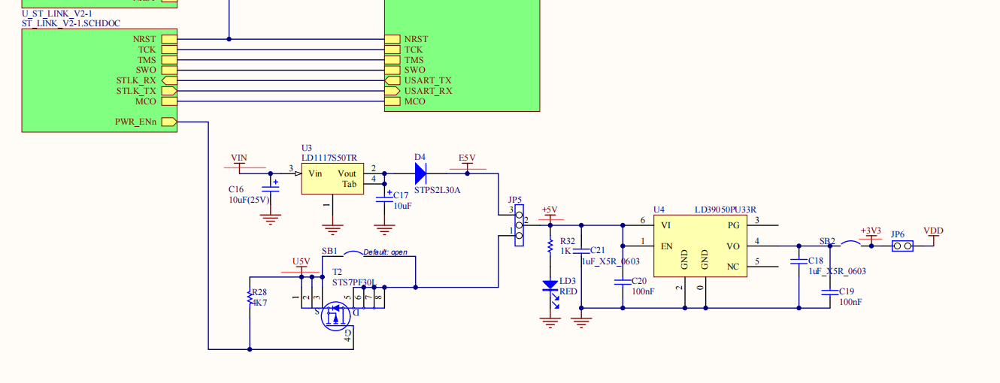

#### 电机供电

##### 分电板

分电板顾名思义就是分电，此外还有稳定电压和降压的功能，通过XT60模块接收来自电池的电流，然后向外输出；

具体的输出电压有3V3(VCC)、5V（下侧标出）、12V（下侧和侧边）。

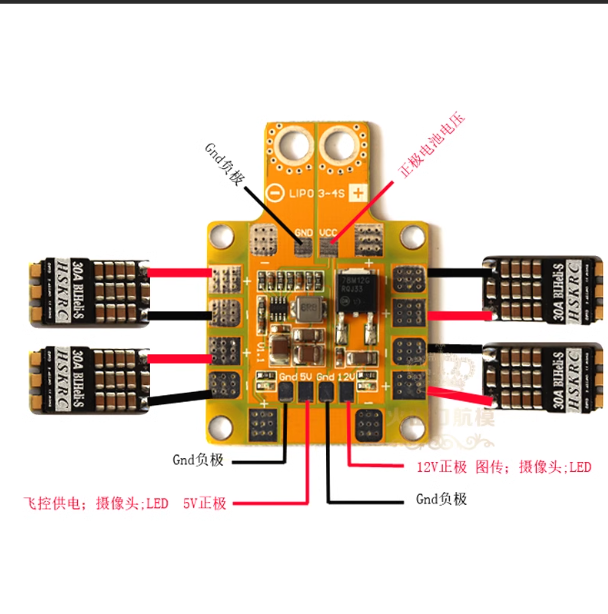

通过焊接方式可以将分电板固定在机架层，方便后续对整个系统的供电

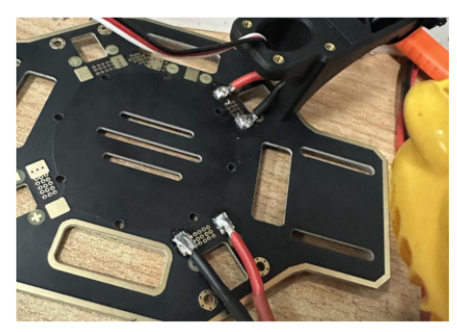

##### 电调

即：电机调速器

关于电机和电调详细工作原理的介绍，大家可以参考下面这篇文章：

[有刷电机，无刷电机和电调的原理](https://blog.csdn.net/qq_41675265/article/details/126028135)

我们只需要知道电调能够更加快速稳定地收发信号，从接收机获得油门信号并控制电机转速变化，总结下来的使用和连接方式就是：

- 电调的输入线与稳压电源连接；
- 电调的输出线与电机连接；
- 电调的信号线与接收机连接。

### 调试部分

#### OLED

在使用GY-86模块获取x,y,z三部分的ACC和GYRO，我们可以封装相应函数，通过程序控制OLED实时展示出相关数据信息，方便后续调试

#### 串口

在规划引脚时，我们也提前预留好了一个串口数据线USART6，在裸机测试时可以通过USB-TTL模块，在上位机对开发板发送指令（或者从开发板接收指令）

## 绘制

第一版使用AD绘制，由于是初次绘制转接板，关于坐标尺寸没有按照官方开发板的规定设计，后面模块位置出现了部分挤占；此外，分电板的转接口封装也与购买时的XT60不同。

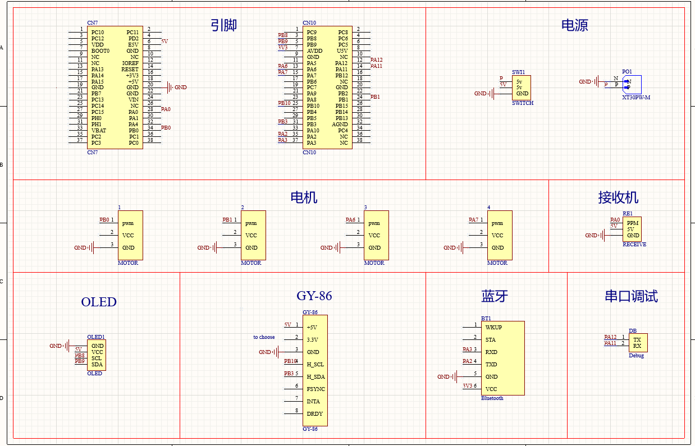

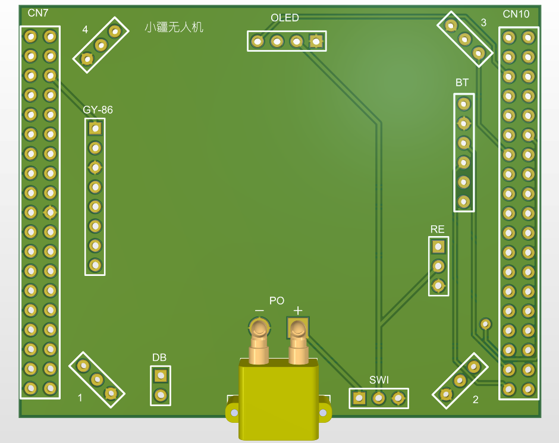

第二版以及第三版我们都采用嘉立创的EDA来进行绘制和修改，立创EDA相比AD使用起来更加灵活，同时也方便后续打板的试错，具体的使用手册大家可以参考官方文档：[立创EDA快速入门](https://prodocs.lceda.cn/cn/quick-start.html)。

### 导入原理图

在AD中将目标文件另存为二进制文件，然后在立创EDA中导入，之后再更新封装，绘制PCB图，使用到的封装大致如下：

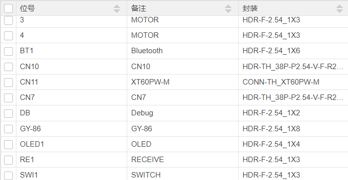

### 个性化设计

#### 板框

如果对板框形状有要求的话，可以导入DXF文件，双击导入层，可以选择导入的图层

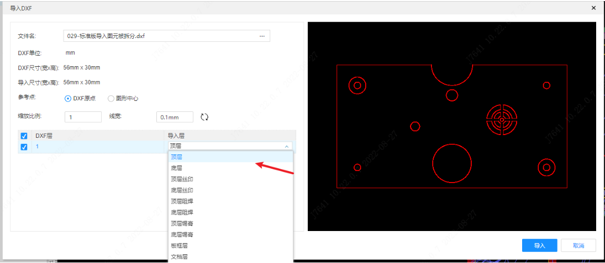

#### Logo

支持图片格式有：SVGZ、SVG、PNG、PIP、JPG、PJPEG、JPEG、JFIF格式

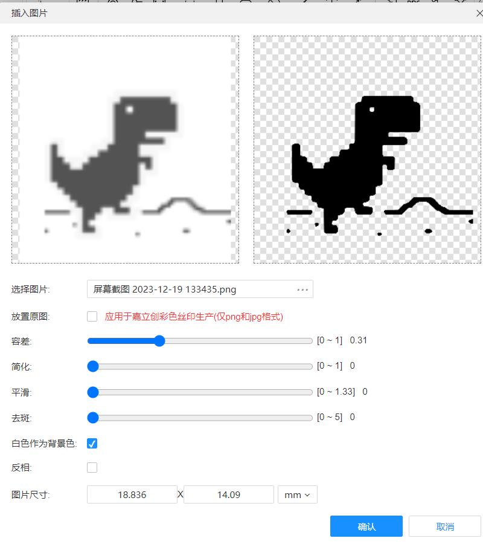

### 成品

经过修改调整，我们组最终的转接板大致如下：

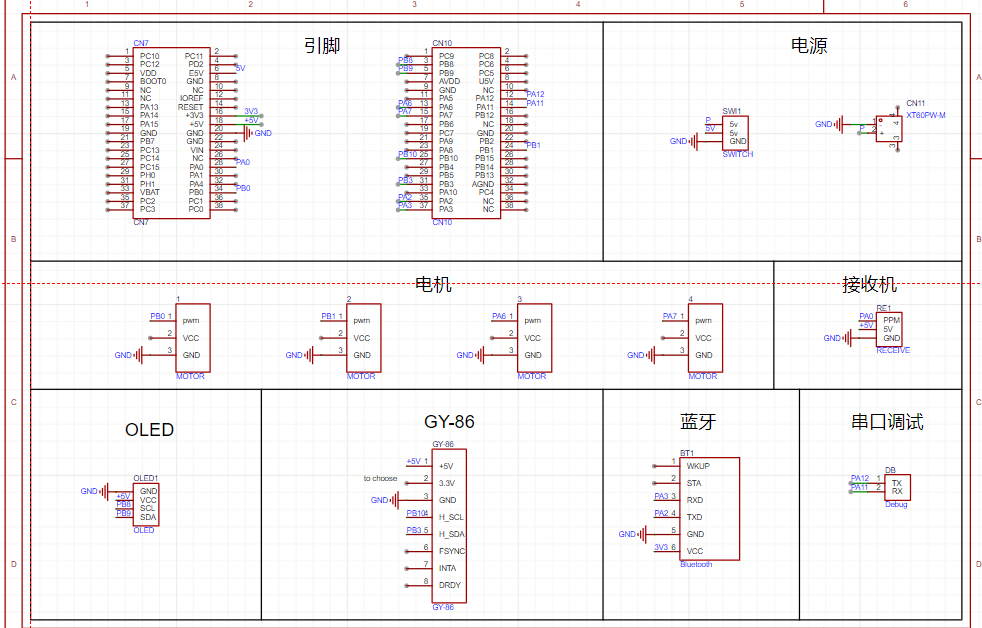

得到的PCB文件生成Gerber格式的文件，可以在嘉立创平台免费下单打样：领取免费券->上传PCB文件->选择相应信息下单。

## 验证

### 电源

在得到成品PCB板之后，上电测试之前可以使用万用表简单检测一下电路VCC、GND等是否正确连接。先将万用表调至通断档，短接表头听到“滴滴”声响表明万用表能正常工作；然后依次测量VCC两端、GND两端以及VCC+GND，接通时能听到“滴滴''声，不接通时无声响即检测通过。

此外万用表还可以用来测试电阻、交流电压、电流、温度等数据。

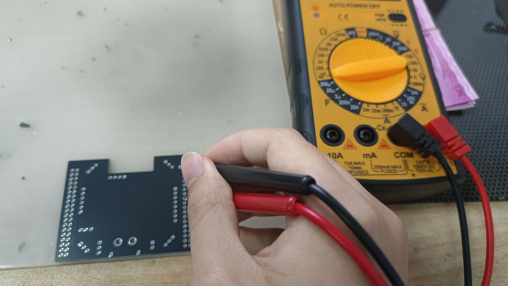

> 理论上电路网络设计合理，且PCB绘制后通过了DRC规则检查的话，PCB板的电源应该没有问题，不过为了不烧坏开发板，还是可以检测一下。

### 信号

示波器的使用：

将程序烧录至开发板，启动示波器，钳子一端接板上GND接口，另一端连接目标GPIO口（即发出PWM信号的引脚），可以使用Autoset功能自动设置方波展示，也可以手动调节显示波长和振幅等信息；

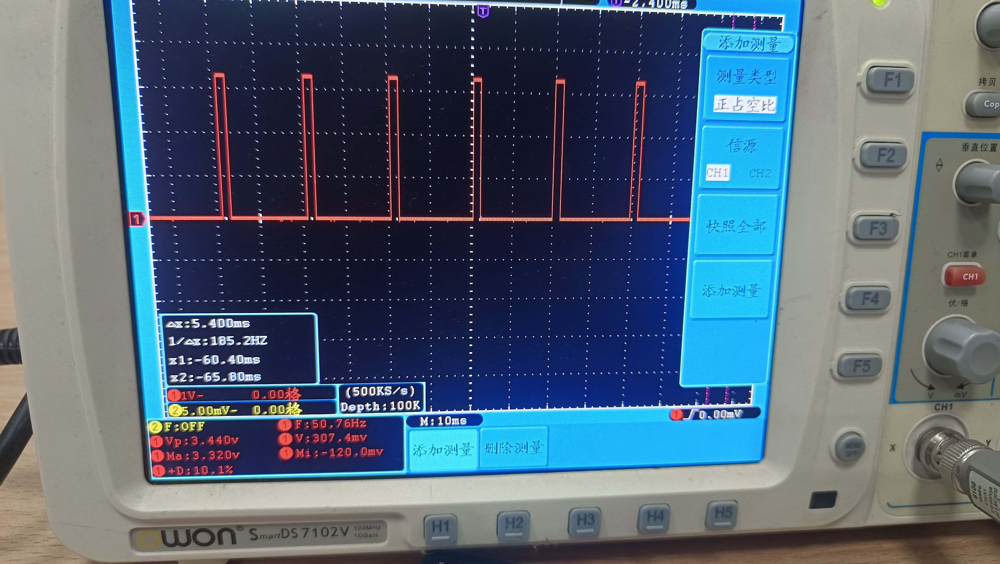

如上图测得频率1/Δx:185.2Hz,最大电压Ma3.32V,最小Mi-120mV,占空比+D10.1%等。